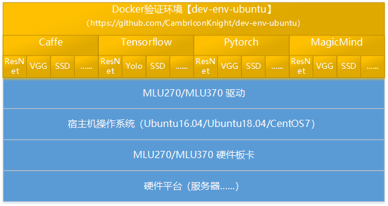

    <a href="https://gitee.com/cambriconknight/dev-env-ubuntu">
        
        <h1 align="center">MLU常用算法移植及验证工具集</h1>
    </a>

# 1. 概述
本[工具集](https://gitee.com/cambriconknight/dev-env-ubuntu)主要基于寒武纪MLU进行移植环境的搭建及常用算法的移植与验证。力求压缩寒武纪MLU环境搭建与功能验证的时间成本, 以便快速上手[寒武纪MLU设备](https://www.cambricon.com/)。

    

> **功能说明：**
>- 可基于 Dockerfile 编译镜像，也可直接加载官网提供的各类镜像(推荐)。
>- 支持 Caffe、PyTorch、TensorFlow 深度学习框架以及MagicMind推理加速引擎。
>- 支持常用算法的部署、移植、在线/离线推理等验证。

*本工具集仅用于个人学习，打通流程； 不对效果负责，不承诺商用。*

## 网络移植图谱

*以下仅为常用网络MLU移植教程，并未包含寒武纪支持的全部网络, 如有新网络需求, 可在 [issue](https://gitee.com/cambriconknight/mlu220-cross-compile-docker-image/issues) 区讨论。*
*在Cambricon Caffe/TF/Pytorch 框架下可支持CPU、MLU（逐层模式）和MFUS（融合模式）三种模式上运行。*

|  AI框架 | 应用领域  | 原始网络  | 网络移植教程   | CPU | MLU | MFUS | OFFLINE |
|:----  |:-------  |:----   |:----   |:----:    |:----: |:----: |:----: |
| Caffe | 图像分类  | [AlexNet](https://github.com/BVLC/caffe/tree/master/models/bvlc_alexnet)  | [移植教程](https://gitee.com/cambriconknight/dev-env-ubuntu/tree/master/caffe/alexnet)  |  ✅ |  ✅ |  ✅ |  ✅ |
| Caffe | 图像分类  | [ResNet-18](https://github.com/HolmesShuan/ResNet-18-Caffemodel-on-ImageNet)  | [移植教程](https://gitee.com/cambriconknight/dev-env-ubuntu/tree/master/caffe/resnet18)  |  ✅ |  ✅ |  ✅ |  ✅ |
| Caffe | 图像分类  | [ResNet-50](https://github.com/KaimingHe/deep-residual-networks)  | [移植教程](https://gitee.com/cambriconknight/dev-env-ubuntu/tree/master/caffe/resnet50)  |  ✅ |  ✅ |  ✅ |  ✅ |
| Caffe | 图像分类  | [VGG16](https://www.robots.ox.ac.uk/~vgg/research/very_deep/)  | [移植教程](https://gitee.com/cambriconknight/dev-env-ubuntu/tree/master/caffe/vgg16)  |  ✅ |  ✅ |  ✅ |  ✅ |
| Caffe | 图像分类  | [MobileNetV1](https://github.com/chuanqi305/MobileNet-SSD)  | [移植教程](https://gitee.com/cambriconknight/dev-env-ubuntu/tree/master/caffe/mobilenetv1)  |  ✅ |  ✅ |  ✅ |  ✅ |
| Caffe | 图像分类  | [MobileNetV2](https://github.com/eric612/MobileNet-SSD-windows/tree/master/models/MobileNetV2)  | [移植教程](https://gitee.com/cambriconknight/dev-env-ubuntu/tree/master/caffe/mobilenetv2)  |  ✅ |  ✅ |  ✅ |  ✅ |
| Caffe | 目标检测  | [Faster R-CNN](https://github.com/rbgirshick/py-faster-rcnn)  | [移植教程](https://gitee.com/cambriconknight/dev-env-ubuntu/tree/master/caffe/faster-rcnn)  |  ✅ |  ✅ |  ✅ |  ✅ |
| Caffe | 目标检测  | [RFCN](https://github.com/YuwenXiong/py-R-FCN)  | [移植教程](https://gitee.com/cambriconknight/dev-env-ubuntu/tree/master/caffe/rfcn)  |  ✅ |  ✅ |  ✅ |  ✅ |
| Caffe | 目标检测  | [MTCNN](https://github.com/kpzhang93/MTCNN_face_detection_alignment)  | [移植教程](https://gitee.com/cambriconknight/dev-env-ubuntu/tree/master/caffe/mtcnn)  |  ✅ |  ✅ |  ✅ |  ✅ |
| Caffe | 目标检测  | [SSD-VGG16](https://github.com/weiliu89/caffe/tree/ssd)  | [移植教程](https://gitee.com/cambriconknight/dev-env-ubuntu/tree/master/caffe/ssd-vgg16)  |  ✅ |  ✅ |  ✅ |  ✅ |
| Caffe | 目标检测  | [YOLOv3](https://github.com/pjreddie/darknet)  | [移植教程](https://gitee.com/cambriconknight/dev-env-ubuntu/tree/master/caffe/yolov3-416)  |  ✅ |  ✅ |  ✅ |  ✅ |
| Caffe | 目标检测  | [YOLOv4](https://github.com/pjreddie/darknet)  | [移植教程](https://gitee.com/cambriconknight/dev-env-ubuntu/tree/master/caffe/yolov4‑mish‑416)  |  ✅ |  ✅ |  ✅ |  ✅ |
| Caffe | 语义分割  | [SegNet](https://github.com/alexgkendall/SegNet-Tutorial)  | [移植教程](https://gitee.com/cambriconknight/dev-env-ubuntu/tree/master/caffe/segnet)  |  ✅ |  ✅ |  ✅ |  ✅ |
| Caffe | 关键点检测  | [OpenPose](https://github.com/CMU-Perceptual-Computing-Lab/openpose)  | [移植教程](https://gitee.com/cambriconknight/dev-env-ubuntu/tree/master/caffe/openpose)  |  ✅ |  ✅ |  ✅ |  ✅ |
| Pytorch | 图像分类  | [ResNet-34](https://github.com/pytorch/vision)  | [移植教程](https://gitee.com/cambriconknight/dev-env-ubuntu/tree/master/pytorch/resnet34)  |  ✅ |  ✅ |  ✅ |  ✅ |
| Pytorch | 图像分类  | [ResNet-50](https://github.com/pytorch/vision)  | [移植教程](https://gitee.com/cambriconknight/dev-env-ubuntu/tree/master/pytorch/resnet50)  |  ✅ |  ✅ |  ✅ |  ✅ |
| Pytorch | 图像分类  | [ResNet-101](https://github.com/pytorch/vision)  | [移植教程](https://gitee.com/cambriconknight/dev-env-ubuntu/tree/master/pytorch/resnet101)  |  ✅ |  ✅ |  ✅ |  ✅ |
| Pytorch | 图像分类  | [VGG16](https://github.com/pytorch/vision)  | [移植教程](https://gitee.com/cambriconknight/dev-env-ubuntu/tree/master/pytorch/vgg16)  |  ✅ |  ✅ |  ✅ |  ✅ |
| Pytorch | 图像分类  | [MobileNetV1](https://modelzoo.co/model/pytorch-mobilenet)  | [移植教程](https://gitee.com/cambriconknight/dev-env-ubuntu/tree/master/pytorch/mobilenetv1)  |  ✅ |  ✅ |  ✅ |  ✅ |
| Pytorch | 图像分类  | [MobileNetV2](https://modelzoo.co/model/mobilenetv2)  | [移植教程](https://gitee.com/cambriconknight/dev-env-ubuntu/tree/master/pytorch/mobilenetv2)  |  ✅ |  ✅ |  ✅ |  ✅ |
| Pytorch | 图像分类  | [DenseNet121](https://github.com/pytorch/vision/blob/main/torchvision/models/densenet.py)  | [移植教程](https://gitee.com/cambriconknight/dev-env-ubuntu/tree/master/pytorch/densenet121)  |  ✅ |  ✅ |  ✅ |  ✅ |
| Pytorch | 目标检测  | [Faster R-CNN](https://github.com/pytorch/vision)  | [移植教程](https://gitee.com/cambriconknight/dev-env-ubuntu/tree/master/pytorch/faster-rcnn)  |  ✅ |  ✅ |  ✅ |  ✅ |
| Pytorch | 目标检测  | [Mask R-CNN](https://github.com/facebookresearch/maskrcnn-benchmark)  | [移植教程](https://gitee.com/cambriconknight/dev-env-ubuntu/tree/master/pytorch/mask-rcnn)  |  ✅ |  ✅ |  ✅ |  ✅ |
| Pytorch | 目标检测  | [SSD-VGG16](https://github.com/amdegroot/ssd.pytorch)  | [移植教程](https://gitee.com/cambriconknight/dev-env-ubuntu/tree/master/pytorch/ssd-vgg16)  |  ✅ |  ✅ |  ✅ |  ✅ |
| Pytorch | 目标检测  | [YOLOv3](https://modelzoo.co/model/pytorch-yolov3-pytorch)  | [移植教程](https://gitee.com/cambriconknight/dev-env-ubuntu/tree/master/pytorch/yolov3)  |  ✅ |  ✅ |  ✅ |  ✅ |
| Pytorch | 目标检测  | [YOLOv4](https://github.com/AlexeyAB/darknet.git)  | [移植教程](https://gitee.com/cambriconknight/dev-env-ubuntu/tree/master/pytorch/yolov4)  |  ✅ |  ✅ |  ✅ |  ✅ |
| Pytorch | 目标检测  | [YOLOv4-Tiny](https://github.com/AlexeyAB/darknet.git)  | [移植教程](https://gitee.com/cambriconknight/dev-env-ubuntu/tree/master/pytorch/yolov4-tiny)  |  ✅ |  ✅ |  ✅ |  ✅ |
| Pytorch | 目标检测  | [YOLOv5](https://github.com/ultralytics/yolov5.git)  | [移植教程](https://gitee.com/cambriconknight/dev-env-ubuntu/tree/master/pytorch/yolov5)  |  ✅ |  ✅ |  ✅ |  ✅ |
| Pytorch | 目标检测  | [CenterNet](https://github.com/xingyizhou/CenterNet)  | [移植教程](https://gitee.com/cambriconknight/dev-env-ubuntu/tree/master/pytorch/centernet)  |  ✅ |  ✅ |  ✅ |  ✅ |

## 硬件环境准备

| 名称           | 数量      | 备注                  |
| :------------ | :--------- | :------------------ |
| 开发主机/服务器 | 一台       |主流配置即可；电源功率按需配置；PCIe Gen.3 x16/Gen.4 x16 |
| MLU270/MLU370    | 一套       | 不同型号板卡尽量避免混插混用 |

## 软件环境准备

| 名称                   | 版本/文件                                              | 备注                                  |
| :-------------------- | :-------------------------------                      | :----------------------------------  |
| Linux OS              | Ubuntu16.04/Ubuntu18.04/CentOS7                       | 宿主机操作系统                         |
| Driver_MLU270         | neuware-mlu270-driver-aarch64-4.9.8.tar.gz            | 依操作系统选择                         |
| Driver_MLU370         | cambricon-mlu-driver-ubuntu18.04-dkms_4.20.7_amd64.deb            | 依操作系统选择                         |

注: 以上软件环境中文件名词, 如有版本升级及名称变化, 可以在 [env.sh](./env.sh) 中进行修改。

## 开发资料下载

MLU开发文档: https://developer.cambricon.com/index/document/index/classid/3.html

Neuware SDK: https://cair.cambricon.com/#/home/catalog?type=SDK%20Release

其他开发资料, 可前往[寒武纪开发者社区](https://developer.cambricon.com)注册账号按需下载。也可在官方提供的专属FTP账户指定路径下载。
