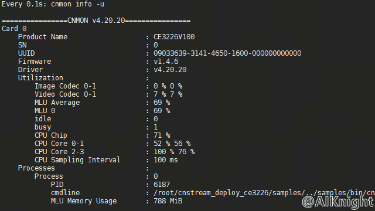

**该教程仅仅用于学习，打通流程； 不对效果负责，不承诺商用。**

# 1. 概述
本目录适配于官方针对寒武纪边缘侧/端侧产品发布的 MagicMind 框架 Docker 容器。 该 Docker 容器可用于各类网络模型的量化及对应生成设备侧部署的离线模型。按照以下步骤可以快速搭建基于Docker容器的开发环境。

**运行环境**

- 主机系统: Ubuntu16.04/Ubuntu18.04/CentOS7
- 软件栈版本: 0.13.0
- 深度学习框架: MagicMind
- 镜像文件: magicmind_0.13.0-1_ubuntu18.04.tar.gz
- Docker: ⽤⼾需要⾃⾏安装docker（版本要求 >= v19.03）

**硬件环境准备:**

| 名称           | 数量      | 备注                  |
| :------------ | :--------- | :------------------ |
| 开发主机/服务器  | 一台       |主流配置即可；         |

**软件环境准备:**

| 名称                   | 版本/文件                                              | 备注                                 |
| :-------------------- | :-------------------------------                      | :---------------------------------- |
| Linux OS              | Ubuntu16.04/Ubuntu18.04/CentOS7                       | 宿主机操作系统                         |
| Docker Image          | magicmind_0.13.0-1_ubuntu18.04.tar.gz                 | 官方针对寒武纪边缘侧/端侧产品发布的 MagicMind 框架 Docker 容器 |

注: 以上软件环境中文件名词, 如有版本升级及名称变化, 可以在 [env.sh](./env.sh) 中进行修改。

**下载地址:**

前往[寒武纪开发者社区](https://developer.cambricon.com)注册账号按需下载， 也可在官方提供的专属FTP账户指定路径下载。

文档: https://developer.cambricon.com/index/document/index/classid/3.html

SDK: https://sdk.cambricon.com/download?component_name=PyTorch

# 2. 目录结构

```bash
.
├── clean.sh                                #清理脚本,包括清理临时目录或文件,已加载的容器等
├── cross_compile                           #用于交叉编译的工作目录
├── dependent_files                         #依赖库及工具下载说明.
├── env.sh                                  #脚本全局环境变量,使用时需要根据实际修改.
├── load-image-dev.sh                       #用作加载docker镜像的脚本
├── README.md                               #目录说明
└── run-container-dev.sh                    #用作启动docker容器的脚本
```
# 3. 下载镜像

下载官方针对寒武纪边缘侧/端侧产品发布的 MagicMind 框架 Docker 容器。 可前往寒武纪开发者社区注册账号按需下载, 也可在官方提供的专属FTP账户指定路径下载。

官方发布的镜像包命名格式: magicmind_<x.y.z>-1_ubuntu<a.b>.tar.gz , 其中 <x.y.z> 为MagicMind 版本号，<a.b> 为操作系统版本号。

# 4. 加载镜像
```bash
#加载Docker镜像
#./load-image-dev.sh /data/ftp/ce3226/mm/0.13.0/magicmind_0.13.0-1_ubuntu18.04.tar.gz
./load-image-dev.sh ${FULLNAME_IMAGES}
```

# 5. 启动容器
```bash
#启动Docker容器
./run-container-dev.sh
```

# 6. 交叉编译

## 6.1. 环境准备

参考以下操作, 根据实际SDK包位置,解压到工作目录.

```bash
# 1. 进入工作目录
cd /home/share/edge/cross_compile
# 2. 设置环境变量(首次进入容器需要设置环境变量)
source env-ce3226.sh
# 3. 更新BSP所需的系统依赖软件(mm镜像中中没有安装的依赖软件)
./update-os.sh
```

## 6.2. BSP交叉编译
**分步说明**
```bash
# 1. 进入工作目录
cd /home/share/edge/cross_compile
# 2. 拷贝或下载sdk到[../dependent_files]目录
#cp -rvf /data/ftp/ce3226/sdk/ce3226v100-sdk-1.1.0.tar.gz ../dependent_files
# 3. 解压SDK到本目录
tar zxvf ../dependent_files/ce3226v100-sdk-1.1.0.tar.gz -C ./
# 4. 解压bsp到本目录
tar zxvf ./ce3226v100-sdk-1.1.0/board/package/bsp.tar.gz -C ./
# 5. 进入bsp编译目录
cd /home/share/edge/cross_compile/bsp/ce3226v100_build/build
# 6.执行make
make all
# 7.编译完后,在out/目录下是生成所有的bsp镜像文件
ls -la ./out
# 8.设置权限,否则可能会导致tftp下载失败
chmod 644 ./out/ubootenv*
ls -la ./out
# 9.备用操作
## 9.1.如需要则修改用户权限
#sudo chown cam:cam -R ./out/*
## 9.2.拷贝到tftp目录
#cp -rvf ./out/*.bin ./out/*.img ./out/*.itb /data/tftp
```
**一键编译**
```bash
# 1.1. 进入工作目录
cd /home/share/edge/cross_compile
# 1.2. 拷贝或下载sdk到[../dependent_files]目录
#cp -rvf /data/ftp/ce3226/sdk/ce3226v100-sdk-1.1.0.tar.gz ../dependent_files
# 2. 一键编译所有的bsp镜像文件, 编译完后,在out/目录下是生成所有的bsp镜像文件
./build-bsp-all.sh
```
**单独编译**
单独编译详见官方发布的SDK使用开发指南.

## 6.3. CNStream交叉编译

### 6.3.1 交叉编译与打包
**一键编译**
```bash
# 1. 环境准备
## 1.1. 进入工作目录
cd /home/share/edge/cross_compile
## 1.2. 拷贝或下载sdk到[../dependent_files]目录
#cp -rvf /data/ftp/ce3226/sdk/ce3226v100-sdk-1.1.0.tar.gz ../dependent_files
# 2. 一键编译cnstream, 编译完后,在cnstream目录下是生成cnstream部署包
./build-cnstream-ce3226.sh.sh
```
**分步说明**
```bash
# 1. 下载EDGE包： 下载edge.tar.gz（EDGE fro CNStream 一体包 ）
cd /home/share/edge/dependent_files
wget http://video.cambricon.com/models/edge.tar.gz
tar zxvf edge.tar.gz

# 2. 下载SDK： 下载并解压mps.tar.gz inference.tar.gz
cd /home/share/edge/dependent_files
tar zxvf ./ce3226v100-sdk-1.1.0.tar.gz
cd /home/share/edge/dependent_files/ce3226v100-sdk-1.1.0/board/package/
## 2.1. 解压mps.tar.gz并设置环境变量MPS_HOME
tar zxvf mps.tar.gz
export MPS_HOME=/home/share/edge/dependent_files/ce3226v100-sdk-1.1.0/board/package/mps/out
## 2.2. inference.tar.gz并同步lib库
tar zxvf inference.tar.gz
# 同步lib库（mm docker镜像环境中 /usr/local/neuware/edge/目录下与inference.tar.gz目录中内容还是有些差异，需要解压后更新过去）
cp -rvf /home/share/edge/dependent_files/ce3226v100-sdk-1.1.0/board/package/inference/* /usr/local/neuware/edge
cp -rvf /home/share/edge/dependent_files/ce3226v100-sdk-1.1.0/board/package/inference/lib64/* $MPS_HOME/lib
cp -rvf /home/share/edge/dependent_files/ce3226v100-sdk-1.1.0/board/package/inference/include/* $MPS_HOME/include

# 3. 编译并安装第三方依赖库
cd /home/share/edge/dependent_files/edge
#source install_edge.sh
# To build opencv with ffmpeg for videoIO
source install_edge.sh opencv_with_ffmpeg

# 4. 设置必要的环境变量
source env.sh

# 5. 下载 CNStream 源码
cd /home/share/edge/cross_compile
git clone https://github.com/Cambricon/cnstream.git -b v7.1.0
cd cnstream && git submodule update --init && cd -

# 6. 编译并打包 CNStream
cd /home/share/edge/dependent_files/edge
export cnstream_dir="/home/share/edge/cross_compile/cnstream"
export target_dir="${cnstream_dir}/cnstream_deploy_ce3226"
./install_cnstream.sh ${cnstream_dir} ${target_dir}

# 7. 微调并重新打包部署文件
cd ${cnstream_dir}
rm -rvf cnstream_deploy_ce3226.tar.gz
#生成环境变量配置文件
TimePackage=$(date +%Y%m%d%H%M%S) # eg:20210131230402.403666251
echo '#!/bin/bash' > ${target_dir}/env.sh
echo "#TimePackage:${TimePackage}" >> ${target_dir}/env.sh
echo 'export LD_LIBRARY_PATH="$PWD/lib:$LD_LIBRARY_PATH"' >> ${target_dir}/env.sh
#重新打包，避免包括上层目录
tar -zcvf cnstream_deploy_ce3226.tar.gz ./cnstream_deploy_ce3226
#查看打包文件
ls -la ${cnstream_dir}/cnstream_deploy_ce3226.tar.gz
```

### 6.3.2 部署验证
```bash
# 0. 拷贝部署包到目标板（根据实际IP地址修改实例中的IP【192.168.0.110】）
cd ${cnstream_dir}
scp cnstream_deploy_ce3226.tar.gz root@192.168.0.110:~/
# 1.SSH登录3226并设置环境变量
#登录3226目标设备并解压部署包
cd /root/
tar zxvf cnstream_deploy_ce3226.tar.gz
#为简单期间，如果非root账户可切换到root账户运行
cd /root/cnstream_deploy_ce3226/
#设置环境变量(第一次登陆板卡需要设置环境变量，注意切换用户后，需要重新设置)
source env.sh

# 2. 运行测试实例
## 2.1. 运行yolov3测试用例
cd /root/cnstream_deploy_ce3226/samples/cns_launcher/object_detection/
./run.sh ce3226 rtsp yolov3
## 2.2. 运行yolov5+track测试用例
cd /root/cnstream_deploy_ce3226/samples/cns_launcher/object_tracking
./run.sh ce3226 rtsp yolov5
#运行过程中可另启终端输入命令【watch -n -1 -c "cnmon info -u"】，查看资源占用情况。
```

**参考以上运行测试实例，测试程序会把检测后的结果通过 RTSP 服务模块推送出去。**

*在局域网任意PC上启动VLC客户端，拉取视频流及资源占用情况，如下图所示：*

<table>
    <tr>
        <td ><center></td>
        <td ><center></td>
    </tr>
</table>

## 6.4. 其他模块交叉编译

其他模型交叉编译详见官方发布的SDK使用开发指南.
