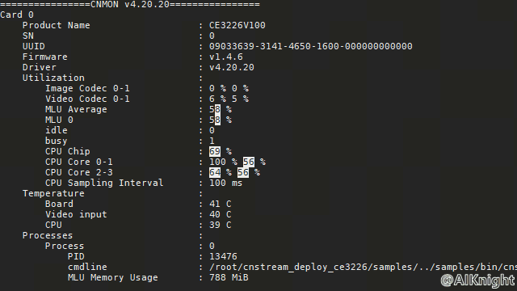

**该教程仅仅用于学习，打通流程； 不对效果负责，不承诺商用。**

<p align="center">
    <a href="https://github.com/CambriconKnight/dev-env-ubuntu/tree/master/edge/cross_compile/README4M100-CNStream.md">
        <h1 align="center">搭建CNStream交叉编译环境并在M100上验证</h1>
    </a>
</p>

[toc]

# 1. 概述

本文基于 [M100](https://mp.weixin.qq.com/s?__biz=Mzg4OTc0MTI1Ng==&mid=2247483770&idx=1&sn=f48e23ce283d9e1008b549981e9ca339&chksm=cfe60bddf89182cb36da258d3a594348a29cea96ddfb0db9ae92d59f4dea0bd10b11d2aa94fa&token=1709753145&lang=zh_CN#rd) 和 [Edge工具集](https://github.com/CambriconKnight/dev-env-ubuntu/tree/master/edge) 进行交叉编译环境搭建与CNStream示例验证。

*M100*： *[M100](https://mp.weixin.qq.com/s?__biz=Mzg4OTc0MTI1Ng==&mid=2247483770&idx=1&sn=f48e23ce283d9e1008b549981e9ca339&chksm=cfe60bddf89182cb36da258d3a594348a29cea96ddfb0db9ae92d59f4dea0bd10b11d2aa94fa&token=1709753145&lang=zh_CN#rd) 是算力 4TOPS，与Jetson Nano/TX2 NX/XAVIER NX模组的外形和引脚兼容，并自带Ubuntu系统及GUI界面。*

*CNStream*： *[CNStream](https://github.com/Cambricon/CNStream) 是基于管道（Pipeline）和事件总线（EventBus）实现了实时数据流分析框架。*

**硬件环境准备:**

| 名称           | 数量      | 备注                  |
| :------------ | :--------- | :------------------ |
| 开发主机/服务器  | 一台       |主流配置即可；         |
| M100+底板  | 一套       |[产品介绍](https://mp.weixin.qq.com/s?__biz=Mzg4OTc0MTI1Ng==&mid=2247483770&idx=1&sn=f48e23ce283d9e1008b549981e9ca339&chksm=cfe60bddf89182cb36da258d3a594348a29cea96ddfb0db9ae92d59f4dea0bd10b11d2aa94fa&token=1709753145&lang=zh_CN#rd)；         |

**软件环境准备:**

| 名称                   | 版本/文件                                              | 备注                                 |
| :-------------------- | :-------------------------------                      | :---------------------------------- |
| Linux OS              | Ubuntu16.04/Ubuntu18.04/CentOS7                       | 宿主机操作系统                         |
| Docker Image          | magicmind_0.13.0-1_ubuntu18.04.tar.gz                 | 官方针对寒武纪边缘侧/端侧产品发布的 MagicMind 框架 Docker 容器 |
| SDK                   | ce3226v100-sdk-1.1.0.tar.gz                           | SDK需联系寒武纪技术服务人员获取 |
| EDGE交叉编译工具包      | edge.tar.gz                 | [http下载地址](http://video.cambricon.com/models/edge.tar.gz) |
| CNStream              | https://github.com/Cambricon/CNStream                 | [Github地址](https://github.com/Cambricon/CNStream) |
| Edge开发环境搭建及验证工具集              | https://github.com/CambriconKnight/dev-env-ubuntu/tree/master/edge                 | [Github地址](https://github.com/CambriconKnight/dev-env-ubuntu/tree/master/edge) |

注: 以上软件环境中文件名词, 如有版本升级及名称变化, 可以在 [env.sh](./env.sh) 中进行修改。

**相关地址:**

前往[寒武纪开发者社区](https://developer.cambricon.com)注册账号按需下载。

文档: https://developer.cambricon.com/index/document/index/classid/3.html

SDK: https://sdk.cambricon.com/download?component_name=PyTorch

# 2. 目录结构

```bash
.
├── clean.sh                                #清理脚本,包括清理临时目录或文件,已加载的容器等
├── cross_compile                           #用于交叉编译的工作目录
├── dependent_files                         #依赖库及工具下载说明.
├── env.sh                                  #脚本全局环境变量,使用时需要根据实际修改.
├── load-image-dev.sh                       #用作加载docker镜像的脚本
├── README.md                               #目录说明
└── run-container-dev.sh                    #用作启动docker容器的脚本
```

# 3. 下载依赖库

**下载方式**
1. 可前往[寒武纪开发者社区](https://developer.cambricon.com)注册账号按需下载到本目录；
2. 可通过官方技术对接人员提供的专属FTP账户指定路径下载；
3. 关注微信公众号 AIKnight , 发送文字消息, 包含关键字(不区分大小写): **dev4m100**, 公众号会自动回复Edge依赖库的下载地址；

请把下载后的依赖库放置到目录(dependent_files)下, 方便进行后续操作。

```bash
./dependent_files/
├── ce3226v100-sdk-1.1.0.tar.gz             #SDK发布包
├── ce3226v100-sdk-1.1.0.tar.gz.md5sum      #SDK发布包MD5值
├── clean.sh                                #清理脚本,包括清理临时目录或文件
├── edge.tar.gz                             #EDGE交叉编译工具包
├── edge.tar.gz.md5sum                      #EDGE交叉编译工具包MD5值
├── magicmind_0.13.0-1_ubuntu18.04.tar.gz   #边缘侧/端侧产品发布的 MagicMind 框架 Docker镜像
├── magicmind_0.13.0-1_ubuntu18.04.tar.gz.md5sum    #Docker镜像MD5值
└── README.md                               #说明
```

# 4. 下载仓库
```bash
#下载仓库
git clone https://github.com/CambriconKnight/dev-env-ubuntu.git
#进入【Edge工具集目录】
cd ./dev-env-ubuntu/edge
```

# 5. 加载镜像

*请提前下载好【Docker镜像】，方便以下操作加载使用。*

```bash
#进入【Edge工具集目录】
cd ./dev-env-ubuntu/edge
#加载Docker镜像
#./load-image-dev.sh ./dependent_files/magicmind_0.13.0-1_ubuntu18.04.tar.gz
./load-image-dev.sh ${FULLNAME_IMAGES}
```

# 6. 启动容器

镜像加载完成后，运行脚本，进入Docker容器。

```bash
#进入【Edge工具集目录】
cd ./dev-env-ubuntu/edge
#启动Docker容器
./run-container-dev.sh
```

# 7. 交叉编译

以下操作步骤均是在官方提供的Docker容器中进行。

**环境准备**

参考以下操作, 根据实际SDK包位置,解压到工作目录.

```bash
# 1. 进入工作目录
cd /home/share/edge/cross_compile
# 2. 设置环境变量(首次进入容器需要设置环境变量)
source env-ce3226.sh
# 3. 更新BSP所需的系统依赖软件(mm镜像中没有安装的依赖软件)
./update-os.sh
```

**一键编译**

拷贝或下载sdk到[../dependent_files]目录，然后进行一键编译与打包。

```bash
# 1. 环境准备
## 1.1. 进入工作目录
cd /home/share/edge/cross_compile
## 1.2. 拷贝或下载sdk到[../dependent_files]目录
#cp -rvf /data/ftp/ce3226/sdk/ce3226v100-sdk-1.1.0.tar.gz ../dependent_files
# 2. 一键编译cnstream, 编译完后,在cnstream目录下是生成cnstream部署包
./build-cnstream-ce3226.sh
#分步说明详见【build-cnstream-ce3226.sh】脚本中注释说明
ls -la ./cnstream/cnstream_deploy_ce3226.tar.gz
```
*注： 以上交叉编译后的CNStream部署包【cnstream_deploy_ce3226.tar.gz】可通过关注公众号 【AIKnight】直接获取：可发送文字消息: **cnstream4ce3226** 获取，此包可直接用于M100上部署验证。*

# 8. 部署验证

```bash
# 0. 拷贝部署包到目标板（根据实际IP地址修改实例中的IP【192.168.0.110】）
cd /home/share/edge/cross_compile/cnstream
scp cnstream_deploy_ce3226.tar.gz root@192.168.0.110:~/
# 1.SSH登录3226并设置环境变量
#登录3226目标设备并解压部署包
cd /root/
tar zxvf cnstream_deploy_ce3226.tar.gz
#为简单期间，如果非root账户可切换到root账户运行
cd /root/cnstream_deploy_ce3226/
#设置环境变量(第一次登陆板卡需要设置环境变量，注意切换用户后，需要重新设置)
source env.sh

# 2. 运行测试实例
## 2.1. 运行yolov3测试用例
#cd /root/cnstream_deploy_ce3226/samples/cns_launcher/object_detection/
#./run.sh ce3226 rtsp yolov3
## 2.2. 运行yolov5+track测试用例
cd /root/cnstream_deploy_ce3226/samples/cns_launcher/object_tracking
./run.sh ce3226 rtsp yolov5
#运行以上任意一个测试实例后，可再另启一个终端输入命令【watch -d -n -1 'cnmon info -u -e'】，查看资源占用情况。
watch -d -n -1 'cnmon info -u -e'
```

**参考以上运行测试实例，测试程序会把检测后的结果通过 RTSP 服务模块推送出去。**

*在局域网任意PC上启动VLC客户端，拉取视频流及资源占用情况，如下图所示：*

<table>
    <tr>
        <td ><center></td>
        <td ><center></td>
    </tr>
</table>

**可扫描下方二维码，关注公众号【AIKnight】，获取更多资讯。**
>
