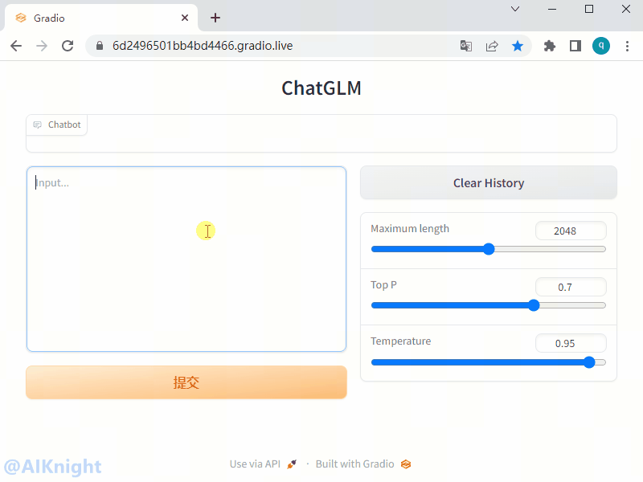
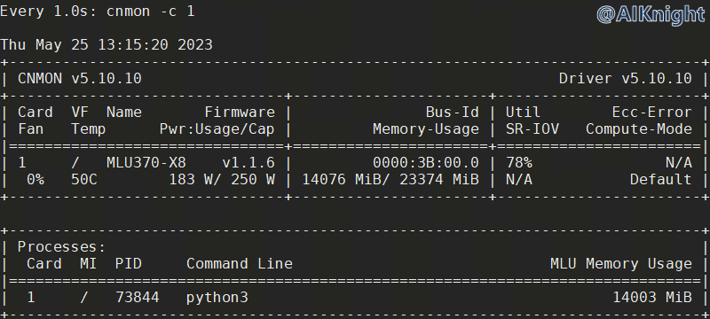

**该教程仅仅用于学习，打通流程； 不对效果负责，不承诺商用。**

# 1. 环境准备

## 1.1. 硬件环境

| 名称           | 数量      | 备注                  |
| :------------ | :--------- | :------------------ |
| 服务器         | 一台       | 采用已完成适配的服务器；PCIe Gen.4 x16 |
| MLU370-S4/X4/x8  | 一套       |使用板卡自带的8pin连接器连接主机电源|

## 1.2. 软件环境

| 名称                   | 版本/文件                                                 | 备注                                 |
| :-------------------- | :-------------------------------                         | :---------------------------------- |
| Linux OS              | Ubuntu16.04/Ubuntu18.04/CentOS7                          | 宿主机操作系统                         |
| Docker Image          | pytorch-v1.13.0-torch1.9-ubuntu18.04-py37.tar.gz         | 官方发布的 Pytorch 框架 Docker 镜像文件 |
| Driver_MLU370         | cambricon-mlu-driver-centos7-5.10.10-1.x86_64.rpm	       | 依操作系统选择                         |
| 工具包                 | https://github.com/CambriconKnight/dev-env-ubuntu        | [Github地址](https://github.com/CambriconKnight/dev-env-ubuntu) |

**下载地址:**
- 前往[寒武纪开发者社区](https://developer.cambricon.com)注册账号按需下载， 也可在官方提供的专属FTP账户指定路径下载。
- 文档: https://developer.cambricon.com/index/document/index/classid/3.html
- SDK: https://sdk.cambricon.com/download?component_name=PyTorch

**AIKnight公众号**
>

## 1.3. 下载仓库
```bash
#进入裸机工作目录，以【/data/github】工作目录为例
cd /data/github
#下载仓库
git clone https://github.com/CambriconKnight/dev-env-ubuntu.git
#进入【工具包目录】
cd ./dev-env-ubuntu/pytorch1.9
```
## 1.4. 加载镜像

请提前下载好【Docker镜像】，方便以下操作加载使用。

```bash
#进入【工具包目录】
cd ./dev-env-ubuntu/pytorch1.9
#加载Docker镜像
#./load-image-dev.sh /DATA_SPACE/kang/ftp/docker/pytorch-v1.10.0-torch1.9-ubuntu18.04-py37.tar.gz
./load-image-dev.sh ${FULLNAME_IMAGES}
```

## 1.5. 启动容器

镜像加载完成后，运行脚本，进入Docker容器。

```bash
#进入【工具包目录】
cd ./dev-env-ubuntu/pytorch1.9
#启动Docker容器
./run-container-dev.sh
```

# 2. 模型推理
## 2.1. 安装LFS

安装 Git LFS，实现 Git 对大文件的支持.
```bash
# 进到容器后，切换到工作目录
cd /home/share/pytorch1.9/chatglm
apt-get update
# 安装 Git LFS，实现 Git 对大文件的支持
apt-get install git-lfs
#yum install git-lfs
# Silence all safe.directory warnings
git config --global --add safe.directory '*'
# 执行如下命令后，如果显示Git LFS initialized说明安装成功
git lfs install
# 升级numpy版本
pip install numpy --upgrade
```
## 2.2. 下载代码

下载 transformers 及 chatglm-6b 源码及对应版本的 chatglm-6b 模型（模型较大，下载时间比较长）。
```bash
# 进到容器后，切换到工作目录
cd /home/share/pytorch1.9/chatglm
# 1. 下载 transformers 源码: 基于 transformer 模型结构提供的预训练语言库
git clone -b v4.27.4 https://github.com/huggingface/transformers
# 2. 下载 chatglm-6b 源码
git clone https://github.com/THUDM/ChatGLM-6B
cd ChatGLM-6B && git checkout 82c084b1cb5f2c2973cfb2119fb154f4dbc825b6 && cd -
# 3. 下载 chatglm-6b 模型
##第一种方式： 不推荐使用以下命令。直接 git clone 大模型文件的话，下载模型时间较长.
# git clone https://huggingface.co/THUDM/chatglm-6b
##第二种方式： 采用如下方式， git clone 并手动下载或拷贝过来模型，会更方便些。
GIT_LFS_SKIP_SMUDGE=1 git clone https://huggingface.co/THUDM/chatglm-6b 下载模型实现
# 然后从 https://cloud.tsinghua.edu.cn/d/fb9f16d6dc8f482596c2/ 手动下载的模型和参数文件，替换到本地的 chatglm-6b 目录下。
cp -rvf /data/models/chatglm-6b/pretrained_model/chatglm-6b/pytorch_model-0000*.bin ./chatglm-6b
cp -rvf /data/models/chatglm-6b/pretrained_model/chatglm-6b/ice_text.model ./chatglm-6b
# 注意： 如果后续操作中，有shape mismatch之类报错，多半是模型更新了，需要下载对应的模型。
##第三种方式： 为保证与以上代码对应的模型，也可以通过关注微信公众号 【AIKnight】,
# 发送关键字(不区分大小写): **chatglm-6b**, 公众号会自动回复对应下载地址.
# 下载完毕后，可把下载后的【chatglm-6b】目录拷贝到当前目录。
cp -rvf /data/baidudisk/chatglm-6b ./
#mv -f /DATA_SPACE/baidudisk/chatglm-6b ./
```

## 2.3. 模型适配
### 2.3.1. 自动迁移代码

使用工具 `torch_gpu2mlu.py` 从 GPU 模型脚本迁移至 MLU 设备运行，转换后的模型脚本只支持 MLU 设备运行。该工具可对模型脚本进行转换，对模型脚本修改位置较多，会对修改位置进行统计，实现开发者快速迁移。

- 在容器环境中，执行以下命令
```bash
cd /home/share/pytorch1.9/chatglm
#建立软连接
ln -s /torch/src/catch/tools/torch_gpu2mlu.py ./
#执行转换模型脚本, 自动修改 transformers 源码
python torch_gpu2mlu.py -i transformers
#执行转换模型脚本, 自动修改  ChatGLM-6B 源码
python torch_gpu2mlu.py -i ChatGLM-6B
#显示转换后的代码。
#ls -lh transformers transformers_mlu ChatGLM-6B ChatGLM-6B_mlu
ls -la
```

- 输出转换结果
```bash
(pytorch) root@worker1:/home/share/pytorch1.9/chatglm# python torch_gpu2mlu.py -i transformers
copy error:  /home/share/pytorch1.9/chatglm/transformers/examples/legacy/seq2seq/test_data/test_data
# Cambricon PyTorch Model Migration Report
Official PyTorch model scripts:  /home/share/pytorch1.9/chatglm/transformers
Cambricon PyTorch model scripts:  /home/share/pytorch1.9/chatglm/transformers_mlu
Migration Report:  /home/share/pytorch1.9/chatglm/transformers_mlu/report.md
(pytorch) root@worker1:/home/share/pytorch1.9/chatglm# python torch_gpu2mlu.py -i ChatGLM-6B
# Cambricon PyTorch Model Migration Report
Official PyTorch model scripts:  /home/share/pytorch1.9/chatglm/ChatGLM-6B
Cambricon PyTorch model scripts:  /home/share/pytorch1.9/chatglm/ChatGLM-6B_mlu
Migration Report:  /home/share/pytorch1.9/chatglm/ChatGLM-6B_mlu/report.md
(pytorch) root@worker1:/home/share/pytorch1.9/chatglm#
```

### 2.3.2. 手动修改代码

由于 chatglm-6b 要求使用 torch >=1.10，其中有 pytorch 不支持的特性包括如下。需要在【自动迁移代码】基础上再进行如下修改。

- torch.nn.utils.skip_init
- torch.c.jit_xx
- torch.concat

进入如下目录，修改 modeling_chatglm.py 源码。
```bash
# 进入预训练模型路径（以实际为准）
cd ../chatglm-6b
vim modeling_chatglm.py
```
1. 注释 skip_init 相关代码（注意：不同版本可能会不同）

源码 modeling_chatglm.py 中 skip_init 不支持， skip_init 是 pytorch 1.10.0 版本增加的功能. 而 cambricon pytorch 适配的官方 pytorch 版本为 1.9.0 , 没有 skip_init 。
*以下修改涉及5处，需要全部修改。*
```bash
#from torch.nn.utils import skip_init

#if empty_init:
#    init_method = skip_init
#else:
#    init_method = default_init
init_method = default_init
```
2. 使用 torch.cat 替换 torch.concat

torch 1.9中没有torch.concat, 查询pytorch手册后发现torch 1.10中使用torch.concat替换了torch.cat，因此需要将原代码中的torch.concat改为torch.cat。
```bash
# query_layer = torch.concat([q1, q2], dim=(q1.ndim - 1))
# key_layer = torch.concat([k1, k2], dim=(k1.ndim - 1))
query_layer = torch.cat([q1, q2], dim=(q1.ndim - 1))
key_layer = torch.cat([k1, k2], dim=(k1.ndim - 1))
```
3. 注释掉 jit fusion

把jit fusion相关都注释掉，mlu不支持。
```bash
#if sys.platform != 'darwin':
#    torch._C._jit_set_profiling_mode(False)
#    torch._C._jit_set_profiling_executor(False)
#    torch._C._jit_override_can_fuse_on_cpu(True)
#    torch._C._jit_override_can_fuse_on_gpu(True)
```

### 2.3.3. 安装依赖库

```bash
# 安装 ChatGLM-6B 依赖库
cd /home/share/pytorch1.9/chatglm/ChatGLM-6B_mlu
sed -i 's/torch/# torch/' requirements.txt
pip install -r requirements.txt
# 安装 transformers
cd ../transformers_mlu/
pip install -e .
```

## 2.4. 测试验证
```bash
# 进入ChatGLM-6B_mlu路径（以实际为准）
cd /home/share/pytorch1.9/chatglm/ChatGLM-6B_mlu

# 根据使用的demo，修改cli_demo.py或web_demo.py或api.py中的预训练模型路径“THUDM/chatglm-6b”为实际路径，本教程中此路径修改为【../chatglm-6b】。
# tokenizer = AutoTokenizer.from_pretrained("THUDM/chatglm-6b", trust_remote_code=True)
# model = AutoModel.from_pretrained("THUDM/chatglm-6b", trust_remote_code=True).half().mlu()

# 测试验证
python cli_demo.py
# 或python web_demo.py 或python api.py
# 注意：如使用web_demo.py，需修改demo.queue().launch(share=False, inbrowser=True)中share=True，否则无法看到gradio地址
python web_demo.py
```

### 2.4.1. 测试CLI实例

使用 cli_demo.py测试。

加载比较慢，大概需要10分钟，可耐心等待。
```bash
(pytorch) root@worker1:/home/share/pytorch1.9/chatglm/ChatGLM-6B_mlu# python cli_demo.py
Explicitly passing a `revision` is encouraged when loading a model with custom code to ensure no malicious code has been contributed in a newer revision.
Explicitly passing a `revision` is encouraged when loading a configuration with custom code to ensure no malicious code has been contributed in a newer revision.
Explicitly passing a `revision` is encouraged when loading a model with custom code to ensure no malicious code has been contributed in a newer revision.
Loading checkpoint shards: 100%|███████████████████████████████████████████████████████████████████████████████████████████████████████| 8/8 [00:11<00:00,  1.41s/it]
欢迎使用 ChatGLM-6B 模型，输入内容即可进行对话，clear 清空对话历史，stop 终止程序

用户：chatGPT是啥?

ChatGLM-6B：ChatGPT是美国人工智能研究实验室OpenAI于2022年11月推出的一个人工智能聊天机器人程序，该程序基于大型语言模型GPT-3.5，使用指令微调(Instruction Tuning)和基于人类反馈的强化学习技术(RLHF)训练而成。

用户：stop
(pytorch) root@worker1:/home/share/pytorch1.9/chatglm/ChatGLM-6B_mlu#
```

### 2.4.2. 测试WEB实例

使用 web_demo.py测试 ，需修改 demo.queue().launch(share=False, inbrowser=True) 中 share=True ，否则无法看到 gradio 地址。

*加载比较慢，大概需要10分钟，可耐心等待。*

```bash
(pytorch) root@worker1:/home/share/pytorch1.9/chatglm/ChatGLM-6B_mlu# python web_demo.py
Explicitly passing a `revision` is encouraged when loading a model with custom code to ensure no malicious code has been contributed in a newer revision.
Explicitly passing a `revision` is encouraged when loading a configuration with custom code to ensure no malicious code has been contributed in a newer revision.
Explicitly passing a `revision` is encouraged when loading a model with custom code to ensure no malicious code has been contributed in a newer revision.
Loading checkpoint shards: 100%|███████████████████████████████████████████████████████████████████████████████████████████████████████| 8/8 [00:10<00:00,  1.29s/it]
Running on local URL:  http://127.0.0.1:7860
Running on public URL: https://6d2496501bb4bd4466.gradio.live

This share link expires in 72 hours. For free permanent hosting and GPU upgrades (NEW!), check out Spaces: https://huggingface.co/spaces
```

**Web展示效果**
<p align="left">
    
</p>

### 2.4.3. 测试推理性能
```bash
# 进入ChatGLM-6B_mlu路径（以实际为准）
cd /home/share/pytorch1.9/chatglm/ChatGLM-6B_mlu
# 同步
cp -rvf /home/share/pytorch1.9/chatglm/tools/inference.py /home/share/pytorch1.9/chatglm/ChatGLM-6B_mlu/
# 测试验证
python inference.py
```
**实例**
```bash
(pytorch) root@worker1:/home/share/pytorch1.9/chatglm/ChatGLM-6B_mlu# python inference.py
Explicitly passing a `revision` is encouraged when loading a model with custom code to ensure no malicious code has been contributed in a newer revision.
Explicitly passing a `revision` is encouraged when loading a configuration with custom code to ensure no malicious code has been contributed in a newer revision.
Explicitly passing a `revision` is encouraged when loading a model with custom code to ensure no malicious code has been contributed in a newer revision.
Loading checkpoint shards: 100%|███████████████████████████████████████████████████████████████████████████████████████████████████████| 8/8 [00:10<00:00,  1.28s/it]
/home/share/pytorch1.9/chatglm/transformers_mlu/src/transformers/tokenization_utils_base.py:759: UserWarning:  MLU operators dont support 64-bit calculation. so the 64 bit data will be forcibly converted to 32-bit for calculation.  (Triggered internally at  /torch/catch/torch_mlu/csrc/aten/util/tensor_util.cpp:153.)
  self.data = {k: v.to(device=device) for k, v in self.data.items()}
The dtype of attention mask (torch.int64) is not bool
Hello! How can I assist you today?
==================================================
question:  ChatGLM-6B 是啥?
response:  ChatGLM-6B 是一个基于语言模型的人工智能助手，由清华大学 KEG 实验室和智谱 AI 公司于 2023 年共同训练的语言模型 GLM-6B 开发而成。该助手旨在为用户提供的帮助和回答。
len(response):  97
time_end-time_start:  7.061268091201782
token:  13.736909397457989
==================================================
==================================================
question:  CharGPT 是啥?
response:  CharGPT 是由 OpenAI 于 2022 年 11 月推出的一个人工智能聊天机器人程序，该程序基于大型语言模型 GPT-3.5，使用指令微调(Instruction Tuning)和基于人类反馈的强化学习技术(RLHF)训练而成。
len(response):  119
time_end-time_start:  8.150062799453735
token:  14.6011144856425
==================================================
==================================================
question:  ChatGLM-6B 与 CharGPT 有什么区别?
response:  ChatGLM-6B 和 CharGPT 都是基于语言模型的人工智能助手，但它们在以下几个方面有所不同：

1. 模型大小：ChatGLM-6B 是一个基于 GLM-6B 语言模型的人工智能助手，而 CharGPT 是一个基于 GPT-3.5 语言模型的人工智能助手。

2. 训练数据：ChatGLM-6B 和 CharGPT 的训练数据都来自于互联网上的大量文本数据，但它们的训练数据有所不同。ChatGLM-6B 的训练数据包括了多种不同的主题和语言风格，而 CharGPT 的训练数据则更加多样化，它包括了多种不同的文本类型和语言风格。

3. 功能：ChatGLM-6B 和 CharGPT 的功能也有所不同。ChatGLM-6B 是一个实时的人工智能助手，它可以帮助用户回答各种问题，提供各种帮助。而 CharGPT 则是一种聊天机器人程序，它可以与用户进行对话，回答用户的问题，并提供一些娱乐性的内容。

总的来说，ChatGLM-6B 和 CharGPT 都是基于语言模型的人工智能助手，但它们在模型大小、训练数据、功能等方面有所不同。
len(response):  476
time_end-time_start:  34.9201123714447
token:  13.631113065639516
==================================================
(pytorch) root@worker1:/home/share/pytorch1.9/chatglm/ChatGLM-6B_mlu#
```

# 3. 模型训练
## 3.1. P-Tuning v2
### 3.1.1. 安装软件依赖
运行微调需要4.27.1版本的`transformers`。除 ChatGLM-6B 的依赖之外，还需要安装以下依赖
```bash
pip install rouge_chinese nltk jieba datasets
```
### 3.1.2. 下载数据集
ADGEN 数据集任务为根据输入（content）生成一段广告词（summary）。

```json
{
    "content": "类型#上衣*版型#宽松*版型#显瘦*图案#线条*衣样式#衬衫*衣袖型#泡泡袖*衣款式#抽绳",
    "summary": "这件衬衫的款式非常的宽松，利落的线条可以很好的隐藏身材上的小缺点，穿在身上有着很好的显瘦效果。领口装饰了一个可爱的抽绳，漂亮的绳结展现出了十足的个性，配合时尚的泡泡袖型，尽显女性甜美可爱的气息。"
}
```

从 [Google Drive](https://drive.google.com/file/d/13_vf0xRTQsyneRKdD1bZIr93vBGOczrk/view?usp=sharing) 或者 [Tsinghua Cloud](https://cloud.tsinghua.edu.cn/f/b3f119a008264b1cabd1/?dl=1) 下载处理好的 ADGEN 数据集，将解压后的 `AdvertiseGen` 目录放到本目录下。

```bash
#数据集下载完成后解压
tar zxvf AdvertiseGen.tar.gz
#拷贝数据集到指定目录(以下为 docker 容器内部目录)
cp -rvf AdvertiseGen /home/share/pytorch1.9/chatglm/ChatGLM-6B_mlu/
```

### 3.1.3. 修改训练代码

1. 修改 trainer.py

需要把以下两个文件中的 torch.mlu.random 全部改成 torch_mlu.core.random 。否则会报错【AttributeError: module 'torch.mlu' has no attribute 'random'】。
```bash
#查找目录中所有相关文件
cd /home/share/pytorch1.9/chatglm/
grep -rn torch.mlu.core.random
```
主要包括如下两个文件，替换后，保存文件。
```bash
ChatGLM-6B_mlu/ptuning/trainer.py:2275:                torch.mlu.core.random.set_rng_state(checkpoint_rng_state["mlu"])
ChatGLM-6B_mlu/ptuning/trainer.py:2278:                    torch.mlu.core.random.set_rng_state_all(checkpoint_rng_state["mlu"])
ChatGLM-6B_mlu/ptuning/trainer.py:2370:                rng_states["mlu"] = torch.mlu.core.random.get_rng_state_all()
ChatGLM-6B_mlu/ptuning/trainer.py:2372:                rng_states["mlu"] = torch.mlu.core.random.get_rng_state()
transformers_mlu/src/transformers/trainer.py:2273:                torch.mlu.core.random.set_rng_state(checkpoint_rng_state["mlu"])
transformers_mlu/src/transformers/trainer.py:2276:                    torch.mlu.core.random.set_rng_state_all(checkpoint_rng_state["mlu"])
transformers_mlu/src/transformers/trainer.py:2368:                rng_states["mlu"] = torch.mlu.core.random.get_rng_state_all()
transformers_mlu/src/transformers/trainer.py:2370:                rng_states["mlu"] = torch.mlu.core.random.get_rng_state()
```

2. 训练脚本修改

基于 docker 容器中目录 /home/share/pytorch1.9/chatglm/ChatGLM-6B_mlu/ptuning 下的 `train.sh` 脚本，修改并增加了一份可用于 MLU 的训练启动脚本 `train_mlu.sh`。
```bash
#拷贝脚本到指定目录
cp -rvf /home/share/pytorch1.9/chatglm/tools/train_mlu.sh /home/share/pytorch1.9/chatglm/ChatGLM-6B_mlu/ptuning
```
`train_mlu.sh` 脚本中的相关参数可以根据实际情况修改，保存文件后，即可进行接下来的训练。
`train_mlu.sh` 脚本内容如下：
```bash
PRE_SEQ_LEN=128
LR=2e-2

MLU_VISIBLE_DEVICES=0 python3 main.py \
    --do_train \
    --train_file ../AdvertiseGen/train.json \
    --validation_file ../AdvertiseGen/dev.json \
    --prompt_column content \
    --response_column summary \
    --overwrite_cache \
    --model_name_or_path ../../chatglm-6b \
    --output_dir output/adgen-chatglm-6b-pt-$PRE_SEQ_LEN-$LR \
    --overwrite_output_dir \
    --max_source_length 64 \
    --max_target_length 64 \
    --per_device_train_batch_size 1 \
    --per_device_eval_batch_size 1 \
    --gradient_accumulation_steps 16 \
    --predict_with_generate \
    --max_steps 3000 \
    --logging_steps 10 \
    --save_steps 1000 \
    --learning_rate $LR \
    --pre_seq_len $PRE_SEQ_LEN
```

### 3.1.4. 执行训练

运行以下指令进行训练：

*加载比较慢，大概需要10分钟，可耐心等待。*

```bash
cd /home/share/pytorch1.9/chatglm/ChatGLM-6B_mlu/ptuning
bash train_mlu.sh
```
**实例**
```bash
(pytorch) root@worker1:/home/share/pytorch1.9/chatglm/ChatGLM-6B_mlu/ptuning# bash train_mlu.sh
05/25/2023 13:07:42 - WARNING - __main__ - Process rank: -1, device: mlu:0, n_gpu: 1distributed training: False, 16-bits training: False
05/25/2023 13:07:42 - INFO - __main__ - Training/evaluation parameters Seq2SeqTrainingArguments(
......
)
05/25/2023 13:07:43 - WARNING - datasets.builder - Found cached dataset json (/root/.cache/huggingface/datasets/json/default-3060c7e219b54699/0.0.0/e347ab1c932092252e717ff3f949105a4dd28b27e842dd53157d2f72e276c2e4)
100%|████████████████████████████████████████████████████████████████████████████████████████████████████████████████████████████████| 2/2 [00:00<00:00, 626.67it/s]
[INFO|configuration_utils.py:667] 2023-05-25 13:07:43,955 >> loading configuration file ../../chatglm-6b/config.json
[WARNING|configuration_auto.py:906] 2023-05-25 13:07:43,955 >> Explicitly passing a `revision` is encouraged when loading a configuration with custom code to ensure no malicious code has been contributed in a newer revision.
[INFO|configuration_utils.py:667] 2023-05-25 13:07:43,990 >> loading configuration file ../../chatglm-6b/config.json
[INFO|configuration_utils.py:721] 2023-05-25 13:07:43,991 >> Model config ChatGLMConfig {
......
}

[WARNING|tokenization_auto.py:653] 2023-05-25 13:07:43,992 >> Explicitly passing a `revision` is encouraged when loading a model with custom code to ensure no malicious code has been contributed in a newer revision.
[INFO|tokenization_utils_base.py:1801] 2023-05-25 13:07:44,030 >> loading file ice_text.model
[INFO|tokenization_utils_base.py:1801] 2023-05-25 13:07:44,030 >> loading file added_tokens.json
[INFO|tokenization_utils_base.py:1801] 2023-05-25 13:07:44,030 >> loading file special_tokens_map.json
[INFO|tokenization_utils_base.py:1801] 2023-05-25 13:07:44,030 >> loading file tokenizer_config.json
[WARNING|auto_factory.py:457] 2023-05-25 13:07:44,240 >> Explicitly passing a `revision` is encouraged when loading a model with custom code to ensure no malicious code has been contributed in a newer revision.
[INFO|modeling_utils.py:2401] 2023-05-25 13:07:44,342 >> loading weights file ../../chatglm-6b/pytorch_model.bin.index.json
[INFO|configuration_utils.py:575] 2023-05-25 13:07:44,343 >> Generate config GenerationConfig {
  "_from_model_config": true,
  "bos_token_id": 130004,
  "eos_token_id": 130005,
  "pad_token_id": 3,
  "transformers_version": "4.27.4"
}

Loading checkpoint shards: 100%|██████████████████████████████████████████████████████████████████████████████████████████████████████| 8/8 [00:09<00:00,  1.19s/it]
[INFO|modeling_utils.py:3035] 2023-05-25 13:11:12,453 >> All model checkpoint weights were used when initializing ChatGLMForConditionalGeneration.

[WARNING|modeling_utils.py:3038] 2023-05-25 13:11:12,453 >> Some weights of ChatGLMForConditionalGeneration were not initialized from the model checkpoint at ../../chatglm-6b and are newly initialized: ['transformer.prefix_encoder.embedding.weight']
You should probably TRAIN this model on a down-stream task to be able to use it for predictions and inference.
[INFO|modeling_utils.py:2694] 2023-05-25 13:11:12,518 >> Generation config file not found, using a generation config created from the model config.
input_ids [5, 65421, 61, 67329, 32, 98339, 61, 72043, 32, 65347, 61, 70872, 32, 69768, 61, 68944, 32, 67329, 64103, 61, 96914, 130001, 130004, 5, 87052, 96914, 81471, 64562, 65759, 64493, 64988, 6, 65840, 65388, 74531, 63825, 75786, 64009, 63823, 65626, 63882, 64619, 65388, 6, 64480, 65604, 85646, 110945, 10, 64089, 65966, 87052, 67329, 65544, 6, 71964, 70533, 64417, 63862, 89978, 63991, 63823, 77284, 88473, 64219, 63848, 112012, 6, 71231, 65099, 71252, 66800, 85768, 64566, 64338, 100323, 75469, 63823, 117317, 64218, 64257, 64051, 74197, 6, 63893, 130005, 3, 3, 3, 3, 3, 3, 3, 3, 3, 3, 3, 3, 3, 3, 3, 3, 3, 3, 3, 3, 3, 3, 3, 3, 3, 3, 3, 3, 3, 3, 3, 3, 3, 3, 3, 3, 3, 3, 3, 3, 3, 3]
inputs 类型#裤*版型#宽松*风格#性感*图案#线条*裤型#阔腿裤 宽松的阔腿裤这两年真的吸粉不少,明星时尚达人的心头爱。毕竟好穿时尚,谁都能穿出腿长2米的效果宽松的裤腿,当然是遮肉小能手啊。上身随性自然不拘束,面料亲肤舒适贴身体验感棒棒哒。系带部分增加设计看点,还
label_ids [-100, -100, -100, -100, -100, -100, -100, -100, -100, -100, -100, -100, -100, -100, -100, -100, -100, -100, -100, -100, -100, -100, 130004, 5, 87052, 96914, 81471, 64562, 65759, 64493, 64988, 6, 65840, 65388, 74531, 63825, 75786, 64009, 63823, 65626, 63882, 64619, 65388, 6, 64480, 65604, 85646, 110945, 10, 64089, 65966, 87052, 67329, 65544, 6, 71964, 70533, 64417, 63862, 89978, 63991, 63823, 77284, 88473, 64219, 63848, 112012, 6, 71231, 65099, 71252, 66800, 85768, 64566, 64338, 100323, 75469, 63823, 117317, 64218, 64257, 64051, 74197, 6, 63893, 130005, -100, -100, -100, -100, -100, -100, -100, -100, -100, -100, -100, -100, -100, -100, -100, -100, -100, -100, -100, -100, -100, -100, -100, -100, -100, -100, -100, -100, -100, -100, -100, -100, -100, -100, -100, -100, -100, -100, -100, -100, -100, -100]
labels <image_-100><image_-100><image_-100><image_-100><image_-100><image_-100><image_-100><image_-100><image_-100><image_-100><image_-100><image_-100><image_-100><image_-100><image_-100><image_-100><image_-100><image_-100><image_-100><image_-100><image_-100><image_-100> 宽松的阔腿裤这两年真的吸粉不少,明星时尚达人的心头爱。毕竟好穿时尚,谁都能穿出腿长2米的效果宽松的裤腿,当然是遮肉小能手啊。上身随性自然不拘束,面料亲肤舒适贴身体验感棒棒哒。系带部分增加设计看点,还<image_-100><image_-100><image_-100><image_-100><image_-100><image_-100><image_-100><image_-100><image_-100><image_-100><image_-100><image_-100><image_-100><image_-100><image_-100><image_-100><image_-100><image_-100><image_-100><image_-100><image_-100><image_-100><image_-100><image_-100><image_-100><image_-100><image_-100><image_-100><image_-100><image_-100><image_-100><image_-100><image_-100><image_-100><image_-100><image_-100><image_-100><image_-100><image_-100><image_-100><image_-100><image_-100>
/home/share/pytorch1.9/chatglm/transformers_mlu/src/transformers/optimization.py:396: FutureWarning: This implementation of AdamW is deprecated and will be removed in a future version. Use the PyTorch implementation torch.optim.AdamW instead, or set `no_deprecation_warning=True` to disable this warning
  FutureWarning,
  0%|                                                                                                                                      | 0/3000 [00:00<?, ?it/s]/home/share/pytorch1.9/chatglm/ChatGLM-6B_mlu/ptuning/trainer.py:2578: UserWarning:  MLU operators dont support 64-bit calculation. so the 64 bit data will be forcibly converted to 32-bit for calculation.  (Triggered internally at  /torch/catch/torch_mlu/csrc/aten/util/tensor_util.cpp:153.)
  return data.to(**kwargs)
05/25/2023 13:13:11 - WARNING - transformers_modules.chatglm-6b.modeling_chatglm - `use_cache=True` is incompatible with gradient checkpointing. Setting `use_cache=False`...
/torch/venv3/pytorch/lib/python3.7/site-packages/torch/cuda/amp/autocast_mode.py:134: UserWarning: If running in mlu, torch.cuda.amp is deprecated and will be removed in the future release, please use [torch.mlu.amp] instead. Ignore warning if running in cuda.
  warnings.warn("If running in mlu, torch.cuda.amp is deprecated and will be removed in the future release, please use [torch.mlu.amp] instead. Ignore warning if running in cuda.")
{'loss': 5.5885, 'learning_rate': 0.019933333333333334, 'epoch': 0.0}
{'loss': 5.1672, 'learning_rate': 0.019866666666666668, 'epoch': 0.0}
{'loss': 4.9893, 'learning_rate': 0.0198, 'epoch': 0.0}
{'loss': 4.7983, 'learning_rate': 0.019733333333333335, 'epoch': 0.01}
{'loss': 4.8502, 'learning_rate': 0.019666666666666666, 'epoch': 0.01}
  2%|██                                                                                                                         | 51/3000 [07:22<7:05:22,  8.65s/it]
```

**训练期间MLU资源占用情况**
<p align="left">
    
</p>

*待补充*
