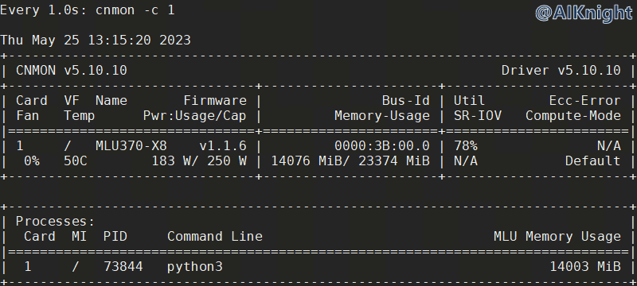

<p align="center">
    <a href="https://gitee.com/cambriconknight/dev-env-ubuntu/blob/master/pytorch1.9/chatglm/README4ChatGLMImages.md">
        
        <h1 align="center">ChatGLM模型MLU验证流程-基于离线验证镜像</h1>
    </a>
</p>

**该教程仅仅用于学习，打通流程； 不对效果负责，不承诺商用。**

[TOC]

# 1. 环境准备

​为方便 ChatGLM-6B 快速验证，可直接按照以下方式，基于已配置并集成好的 ChatGLM-6B 镜像进行推理和训练验证。

## 1.1. 硬件环境

| 名称           | 数量      | 备注                  |
| :------------ | :--------- | :------------------ |
| 服务器         | 一台       | 采用已完成适配的服务器；PCIe Gen.4 x16 |
| MLU370-X4/X8  | 一套       | X8需使用板卡自带的8pin连接器连接主板电源 |

## 1.2. 软件环境

| 名称                   | 版本/文件                                                 | 备注                                 |
| :-------------------- | :-------------------------------                         | :---------------------------------- |
| Linux OS              | Ubuntu16.04/Ubuntu18.04/CentOS7                          | 宿主机操作系统                         |
| ChatGLM Docker Image | pytorch-v1.13.0-torch1.9-ubuntu18.04-py37-ChatGLM.tar.gz         | 环境已配置并集成好的 Docker 镜像文件；此镜像文件可关注微信公众号 【 AIKnight 】, 发送关键字 **chatglm-6b-image** 自动获取；镜像文件大约23G，请安排时间下载； |
| Driver_MLU370         | cambricon-mlu-driver-centos7-5.10.10-1.x86_64.rpm	       | 依操作系统选择                         |
| 工具包                 | https://github.com/CambriconKnight/dev-env-ubuntu        | [Github地址](https://github.com/CambriconKnight/dev-env-ubuntu) |
| ChatGLM-6B 源码         | https://github.com/THUDM/ChatGLM-6B  | commit：82c084b1cb5f2c2973cfb2119fb154f4dbc825b6 |
| Transformers 源码         | https://github.com/huggingface/transformers  | v4.27.4                          |
| ChatGLM-6B 模型         | https://huggingface.co/THUDM/chatglm-6b  | 直接clone 速度慢，可从[Tsinghua Cloud](https://cloud.tsinghua.edu.cn/d/fb9f16d6dc8f482596c2)下载； 为保持版本对应，也可关注微信公众号 【 AIKnight 】, 发送关键字 **chatglm-6b** 自动获取。|

**下载地址:**
- 前往[寒武纪开发者社区](https://developer.cambricon.com)注册账号按需下载， 也可在官方提供的专属FTP账户指定路径下载。
- 文档: https://developer.cambricon.com/index/document/index/classid/3.html
- SDK: https://sdk.cambricon.com/download?component_name=PyTorch

**AIKnight公众号**
>

## 1.3. 下载仓库
```bash
#进入裸机工作目录，以【/data/github】工作目录为例
cd /data/github
#下载仓库
git clone https://github.com/CambriconKnight/dev-env-ubuntu.git
#进入【工具包目录】
cd ./dev-env-ubuntu/pytorch1.9
```
## 1.4. 加载镜像

请提前下载好【Docker镜像】，方便以下操作加载使用。

```bash
#进入【工具包目录】
cd ./dev-env-ubuntu/pytorch1.9
#下载Docker镜像后，可以mv到当前docker目录
#加载Docker镜像
./load-image-dev.sh ./docker/pytorch-v1.10.0-torch1.9-ubuntu18.04-py37-ChatGLM.tar.gz
```

## 1.5. 启动容器

镜像加载完成后，运行脚本，进入Docker容器。

```bash
#进入【工具包目录】
cd ./dev-env-ubuntu/pytorch1.9
#启动Docker容器
./run-container-dev.sh
```
操作实例
```bash
[kangshaopeng@worker1 pytorch1.9]$ ./run-container-dev.sh
0
container-pytorch-v1.13.0-torch1.9-ubuntu18.04-py37-ChatGLM-kang
WARNING: Published ports are discarded when using host network mode
(pytorch) root@worker1:/home/share#
```

以上基于已经搭建好的Docker镜像，方便后续直接测试验证。

# 2. 模型推理
## 2.1. 测试CLI实例

使用 cli_demo.py测试。

```bash
# 进入ChatGLM-6B_mlu路径（以实际为准）
cd /workspace/chatglm/ChatGLM-6B_mlu
# CLI测试验证
python cli_demo.py
```

*加载比较慢，大概需要10分钟，可耐心等待。*

```bash
(pytorch) root@worker1:/workspace/chatglm/ChatGLM-6B_mlu# python cli_demo.py
Explicitly passing a `revision` is encouraged when loading a model with custom code to ensure no malicious code has been contributed in a newer revision.
Explicitly passing a `revision` is encouraged when loading a configuration with custom code to ensure no malicious code has been contributed in a newer revision.
Explicitly passing a `revision` is encouraged when loading a model with custom code to ensure no malicious code has been contributed in a newer revision.
Loading checkpoint shards: 100%|███████████████████████████████████████████████████████████████████████████████████████████████████████| 8/8 [00:11<00:00,  1.41s/it]
欢迎使用 ChatGLM-6B 模型，输入内容即可进行对话，clear 清空对话历史，stop 终止程序

用户：chatGPT是啥?

ChatGLM-6B：ChatGPT是美国人工智能研究实验室OpenAI于2022年11月推出的一个人工智能聊天机器人程序，该程序基于大型语言模型GPT-3.5，使用指令微调(Instruction Tuning)和基于人类反馈的强化学习技术(RLHF)训练而成。

用户：stop
(pytorch) root@worker1:/workspace/chatglm/ChatGLM-6B_mlu#
```

## 2.2. 测试WEB实例

使用 web_demo.py测试 ，需修改 demo.queue().launch(share=False, inbrowser=True) 中 share=True ，否则无法看到 gradio 地址。

使用 cli_demo.py测试。
```bash
# 进入ChatGLM-6B_mlu路径（以实际为准）
cd /workspace/chatglm/ChatGLM-6B_mlu
# WEB测试验证
python web_demo.py
```

*加载比较慢，大概需要10分钟，可耐心等待。*

```bash
(pytorch) root@worker1:/workspace/chatglm/ChatGLM-6B_mlu# python web_demo.py
Explicitly passing a `revision` is encouraged when loading a model with custom code to ensure no malicious code has been contributed in a newer revision.
Explicitly passing a `revision` is encouraged when loading a configuration with custom code to ensure no malicious code has been contributed in a newer revision.
Explicitly passing a `revision` is encouraged when loading a model with custom code to ensure no malicious code has been contributed in a newer revision.
Loading checkpoint shards: 100%|███████████████████████████████████████████████████████████████████████████████████████████████████████| 8/8 [00:10<00:00,  1.29s/it]
Running on local URL:  http://127.0.0.1:7860
Running on public URL: https://6d2496501bb4bd4466.gradio.live

This share link expires in 72 hours. For free permanent hosting and GPU upgrades (NEW!), check out Spaces: https://huggingface.co/spaces
```

**Web展示效果**
<p align="left">
    
</p>

## 2.3. 测试推理性能
```bash
# 进入ChatGLM-6B_mlu路径（以实际为准）
cd /workspace/chatglm/ChatGLM-6B_mlu
# 同步
cp -rvf /workspace/chatglm/tools/inference.py /workspace/chatglm/ChatGLM-6B_mlu/
# 测试验证
python inference.py
```
**实例**
```bash
(pytorch) root@worker1:/workspace/chatglm/ChatGLM-6B_mlu# python inference.py
Explicitly passing a `revision` is encouraged when loading a model with custom code to ensure no malicious code has been contributed in a newer revision.
Explicitly passing a `revision` is encouraged when loading a configuration with custom code to ensure no malicious code has been contributed in a newer revision.
Explicitly passing a `revision` is encouraged when loading a model with custom code to ensure no malicious code has been contributed in a newer revision.
Loading checkpoint shards: 100%|███████████████████████████████████████████████████████████████████████████████████████████████████████| 8/8 [00:10<00:00,  1.28s/it]
/workspace/chatglm/transformers_mlu/src/transformers/tokenization_utils_base.py:759: UserWarning:  MLU operators dont support 64-bit calculation. so the 64 bit data will be forcibly converted to 32-bit for calculation.  (Triggered internally at  /torch/catch/torch_mlu/csrc/aten/util/tensor_util.cpp:153.)
  self.data = {k: v.to(device=device) for k, v in self.data.items()}
The dtype of attention mask (torch.int64) is not bool
Hello! How can I assist you today?
==================================================
question:  ChatGLM-6B 是啥?
response:  ChatGLM-6B 是一个基于语言模型的人工智能助手，由清华大学 KEG 实验室和智谱 AI 公司于 2023 年共同训练的语言模型 GLM-6B 开发而成。该助手旨在为用户提供的帮助和回答。
len(response):  97
time_end-time_start:  7.061268091201782
token:  13.736909397457989
==================================================
==================================================
question:  ChatGPT 是啥?
response:  ChatGPT 是由 OpenAI 于 2022 年 11 月推出的一个人工智能聊天机器人程序，该程序基于大型语言模型 GPT-3.5，使用指令微调(Instruction Tuning)和基于人类反馈的强化学习技术(RLHF)训练而成。
len(response):  119
time_end-time_start:  8.150062799453735
token:  14.6011144856425
==================================================
==================================================
question:  ChatGLM-6B 与 ChatGPT 有什么区别?
response:  ChatGLM-6B 和 ChatGPT 都是基于语言模型的人工智能助手，但它们在以下几个方面有所不同：

1. 模型大小：ChatGLM-6B 是一个基于 GLM-6B 语言模型的人工智能助手，而 ChatGPT 是一个基于 GPT-3.5 语言模型的人工智能助手。

2. 训练数据：ChatGLM-6B 和 ChatGPT 的训练数据都来自于互联网上的大量文本数据，但它们的训练数据有所不同。ChatGLM-6B 的训练数据包括了多种不同的主题和语言风格，而 ChatGPT 的训练数据则更加多样化，它包括了多种不同的文本类型和语言风格。

3. 功能：ChatGLM-6B 和 ChatGPT 的功能也有所不同。ChatGLM-6B 是一个实时的人工智能助手，它可以帮助用户回答各种问题，提供各种帮助。而 ChatGPT 则是一种聊天机器人程序，它可以与用户进行对话，回答用户的问题，并提供一些娱乐性的内容。

总的来说，ChatGLM-6B 和 ChatGPT 都是基于语言模型的人工智能助手，但它们在模型大小、训练数据、功能等方面有所不同。
len(response):  476
time_end-time_start:  34.9201123714447
token:  13.631113065639516
==================================================
(pytorch) root@worker1:/workspace/chatglm/ChatGLM-6B_mlu#
```

# 3. 模型训练
## 3.1. P-Tuning v2
### 3.1.1. 安装软件依赖
运行微调需要4.27.1版本的`transformers`。除 ChatGLM-6B 的依赖之外，还需要安装以下依赖（如果基于打包好的Docker测试镜像，以下可不执行）。
```bash
pip install rouge_chinese nltk jieba datasets
#pip download rouge_chinese nltk jieba datasets
```
### 3.1.2. 下载数据集
ADGEN 数据集任务为根据输入（content）生成一段广告词（summary）。

```json
{
    "content": "类型#上衣*版型#宽松*版型#显瘦*图案#线条*衣样式#衬衫*衣袖型#泡泡袖*衣款式#抽绳",
    "summary": "这件衬衫的款式非常的宽松，利落的线条可以很好的隐藏身材上的小缺点，穿在身上有着很好的显瘦效果。领口装饰了一个可爱的抽绳，漂亮的绳结展现出了十足的个性，配合时尚的泡泡袖型，尽显女性甜美可爱的气息。"
}
```

从 [Google Drive](https://drive.google.com/file/d/13_vf0xRTQsyneRKdD1bZIr93vBGOczrk/view?usp=sharing) 或者 [Tsinghua Cloud](https://cloud.tsinghua.edu.cn/f/b3f119a008264b1cabd1/?dl=1) 下载处理好的 ADGEN 数据集，将解压后的 `AdvertiseGen` 目录放到本目录下。

```bash
#数据集下载完成后解压
tar zxvf AdvertiseGen.tar.gz
#拷贝数据集到指定目录(以下为 docker 容器内部目录)
cp -rvf AdvertiseGen /workspace/chatglm/ChatGLM-6B_mlu/
```

### 3.1.3. 修改训练代码

1. 修改 trainer.py

需要把以下两个文件中的 torch.mlu.random 全部改成 torch_mlu.core.random 。否则会报错【AttributeError: module 'torch.mlu' has no attribute 'random'】。
```bash
#查找目录中所有相关文件
cd /workspace/chatglm/
grep -rn torch.mlu.random
#指定目录下所有文件， torch.mlu.random 全部改成 torch_mlu.core.random
#sed -i "s/torch.mlu.random/torch_mlu.core.random/g" `grep torch.mlu.random -rl /workspace/chatglm`
#替换指定文件的字符串
sed -i "s/torch.mlu.random/torch_mlu.core.random/g" /workspace/chatglm/ChatGLM-6B_mlu/ptuning/trainer.py
sed -i "s/torch.mlu.random/torch_mlu.core.random/g" /workspace/chatglm/transformers_mlu/src/transformers/trainer.py
#检查已经替换的文件
grep -rn torch_mlu.core.random
```
主要包括如下两个文件，替换后，保存文件。
```bash
ChatGLM-6B_mlu/ptuning/trainer.py:2275:                torch.mlu.random.set_rng_state(checkpoint_rng_state["mlu"])
ChatGLM-6B_mlu/ptuning/trainer.py:2278:                    torch.mlu.random.set_rng_state_all(checkpoint_rng_state["mlu"])
ChatGLM-6B_mlu/ptuning/trainer.py:2370:                rng_states["mlu"] = torch.mlu.random.get_rng_state_all()
ChatGLM-6B_mlu/ptuning/trainer.py:2372:                rng_states["mlu"] = torch.mlu.random.get_rng_state()
transformers_mlu/src/transformers/trainer.py:2273:                torch.mlu.random.set_rng_state(checkpoint_rng_state["mlu"])
transformers_mlu/src/transformers/trainer.py:2276:                    torch.mlu.random.set_rng_state_all(checkpoint_rng_state["mlu"])
transformers_mlu/src/transformers/trainer.py:2368:                rng_states["mlu"] = torch.mlu.random.get_rng_state_all()
transformers_mlu/src/transformers/trainer.py:2370:                rng_states["mlu"] = torch.mlu.random.get_rng_state()
```
替换后的检查
```bash
(pytorch) root@worker1:/workspace/chatglm# grep -rn torch_mlu.core.random
ChatGLM-6B_mlu/ptuning/trainer.py:2275:                torch_mlu.core.random.set_rng_state(checkpoint_rng_state["mlu"])
ChatGLM-6B_mlu/ptuning/trainer.py:2278:                    torch_mlu.core.random.set_rng_state_all(checkpoint_rng_state["mlu"])
ChatGLM-6B_mlu/ptuning/trainer.py:2370:                rng_states["mlu"] = torch_mlu.core.random.get_rng_state_all()
ChatGLM-6B_mlu/ptuning/trainer.py:2372:                rng_states["mlu"] = torch_mlu.core.random.get_rng_state()
transformers_mlu/src/transformers/trainer.py:2273:                torch_mlu.core.random.set_rng_state(checkpoint_rng_state["mlu"])
transformers_mlu/src/transformers/trainer.py:2276:                    torch_mlu.core.random.set_rng_state_all(checkpoint_rng_state["mlu"])
transformers_mlu/src/transformers/trainer.py:2368:                rng_states["mlu"] = torch_mlu.core.random.get_rng_state_all()
transformers_mlu/src/transformers/trainer.py:2370:                rng_states["mlu"] = torch_mlu.core.random.get_rng_state()
(pytorch) root@worker1:/workspace/chatglm#
```

2. 训练脚本修改

基于 docker 容器中目录 /workspace/chatglm/ChatGLM-6B_mlu/ptuning 下的 `train.sh` 脚本，修改并增加了一份可用于 MLU 的训练启动脚本 `train_mlu.sh`。
```bash
#拷贝脚本到指定目录
cp -rvf /home/share/pytorch1.9/chatglm/tools/train_mlu.sh /workspace/chatglm/ChatGLM-6B_mlu/ptuning
```
`train_mlu.sh` 脚本中的相关参数可以根据实际情况修改，保存文件后，即可进行接下来的训练。
`train_mlu.sh` 脚本内容如下：
```bash
PRE_SEQ_LEN=128
LR=2e-2

MLU_VISIBLE_DEVICES=0 python3 main.py \
    --do_train \
    --train_file ../AdvertiseGen/train.json \
    --validation_file ../AdvertiseGen/dev.json \
    --prompt_column content \
    --response_column summary \
    --overwrite_cache \
    --model_name_or_path ../../chatglm-6b \
    --output_dir output/adgen-chatglm-6b-pt-$PRE_SEQ_LEN-$LR \
    --overwrite_output_dir \
    --max_source_length 64 \
    --max_target_length 64 \
    --per_device_train_batch_size 1 \
    --per_device_eval_batch_size 1 \
    --gradient_accumulation_steps 16 \
    --predict_with_generate \
    --max_steps 3000 \
    --logging_steps 10 \
    --save_steps 1000 \
    --learning_rate $LR \
    --pre_seq_len $PRE_SEQ_LEN
```

### 3.1.4. 执行训练

运行以下指令进行训练：

*加载比较慢，大概需要10分钟，可耐心等待。*

```bash
cd /workspace/chatglm/ChatGLM-6B_mlu/ptuning
#根据实际情况指定对应的卡
export MLU_VISIBLE_DEVICES=8
bash train_mlu.sh
```
**实例**
```bash
(pytorch) root@worker1:/workspace/chatglm/ChatGLM-6B_mlu/ptuning# bash train_mlu.sh
05/25/2023 13:07:42 - WARNING - __main__ - Process rank: -1, device: mlu:0, n_gpu: 1distributed training: False, 16-bits training: False
05/25/2023 13:07:42 - INFO - __main__ - Training/evaluation parameters Seq2SeqTrainingArguments(
......
)
05/25/2023 13:07:43 - WARNING - datasets.builder - Found cached dataset json (/root/.cache/huggingface/datasets/json/default-3060c7e219b54699/0.0.0/e347ab1c932092252e717ff3f949105a4dd28b27e842dd53157d2f72e276c2e4)
100%|████████████████████████████████████████████████████████████████████████████████████████████████████████████████████████████████| 2/2 [00:00<00:00, 626.67it/s]
[INFO|configuration_utils.py:667] 2023-05-25 13:07:43,955 >> loading configuration file ../../chatglm-6b/config.json
[WARNING|configuration_auto.py:906] 2023-05-25 13:07:43,955 >> Explicitly passing a `revision` is encouraged when loading a configuration with custom code to ensure no malicious code has been contributed in a newer revision.
[INFO|configuration_utils.py:667] 2023-05-25 13:07:43,990 >> loading configuration file ../../chatglm-6b/config.json
[INFO|configuration_utils.py:721] 2023-05-25 13:07:43,991 >> Model config ChatGLMConfig {
......
}

[WARNING|tokenization_auto.py:653] 2023-05-25 13:07:43,992 >> Explicitly passing a `revision` is encouraged when loading a model with custom code to ensure no malicious code has been contributed in a newer revision.
[INFO|tokenization_utils_base.py:1801] 2023-05-25 13:07:44,030 >> loading file ice_text.model
[INFO|tokenization_utils_base.py:1801] 2023-05-25 13:07:44,030 >> loading file added_tokens.json
[INFO|tokenization_utils_base.py:1801] 2023-05-25 13:07:44,030 >> loading file special_tokens_map.json
[INFO|tokenization_utils_base.py:1801] 2023-05-25 13:07:44,030 >> loading file tokenizer_config.json
[WARNING|auto_factory.py:457] 2023-05-25 13:07:44,240 >> Explicitly passing a `revision` is encouraged when loading a model with custom code to ensure no malicious code has been contributed in a newer revision.
[INFO|modeling_utils.py:2401] 2023-05-25 13:07:44,342 >> loading weights file ../../chatglm-6b/pytorch_model.bin.index.json
[INFO|configuration_utils.py:575] 2023-05-25 13:07:44,343 >> Generate config GenerationConfig {
  "_from_model_config": true,
  "bos_token_id": 130004,
  "eos_token_id": 130005,
  "pad_token_id": 3,
  "transformers_version": "4.27.4"
}

Loading checkpoint shards: 100%|██████████████████████████████████████████████████████████████████████████████████████████████████████| 8/8 [00:09<00:00,  1.19s/it]
[INFO|modeling_utils.py:3035] 2023-05-25 13:11:12,453 >> All model checkpoint weights were used when initializing ChatGLMForConditionalGeneration.

[WARNING|modeling_utils.py:3038] 2023-05-25 13:11:12,453 >> Some weights of ChatGLMForConditionalGeneration were not initialized from the model checkpoint at ../../chatglm-6b and are newly initialized: ['transformer.prefix_encoder.embedding.weight']
You should probably TRAIN this model on a down-stream task to be able to use it for predictions and inference.
[INFO|modeling_utils.py:2694] 2023-05-25 13:11:12,518 >> Generation config file not found, using a generation config created from the model config.
input_ids [5, 65421, 61, 67329, 32, 98339, 61, 72043, 32, 65347, 61, 70872, 32, 69768, 61, 68944, 32, 67329, 64103, 61, 96914, 130001, 130004, 5, 87052, 96914, 81471, 64562, 65759, 64493, 64988, 6, 65840, 65388, 74531, 63825, 75786, 64009, 63823, 65626, 63882, 64619, 65388, 6, 64480, 65604, 85646, 110945, 10, 64089, 65966, 87052, 67329, 65544, 6, 71964, 70533, 64417, 63862, 89978, 63991, 63823, 77284, 88473, 64219, 63848, 112012, 6, 71231, 65099, 71252, 66800, 85768, 64566, 64338, 100323, 75469, 63823, 117317, 64218, 64257, 64051, 74197, 6, 63893, 130005, 3, 3, 3, 3, 3, 3, 3, 3, 3, 3, 3, 3, 3, 3, 3, 3, 3, 3, 3, 3, 3, 3, 3, 3, 3, 3, 3, 3, 3, 3, 3, 3, 3, 3, 3, 3, 3, 3, 3, 3, 3, 3]
inputs 类型#裤*版型#宽松*风格#性感*图案#线条*裤型#阔腿裤 宽松的阔腿裤这两年真的吸粉不少,明星时尚达人的心头爱。毕竟好穿时尚,谁都能穿出腿长2米的效果宽松的裤腿,当然是遮肉小能手啊。上身随性自然不拘束,面料亲肤舒适贴身体验感棒棒哒。系带部分增加设计看点,还
label_ids [-100, -100, -100, -100, -100, -100, -100, -100, -100, -100, -100, -100, -100, -100, -100, -100, -100, -100, -100, -100, -100, -100, 130004, 5, 87052, 96914, 81471, 64562, 65759, 64493, 64988, 6, 65840, 65388, 74531, 63825, 75786, 64009, 63823, 65626, 63882, 64619, 65388, 6, 64480, 65604, 85646, 110945, 10, 64089, 65966, 87052, 67329, 65544, 6, 71964, 70533, 64417, 63862, 89978, 63991, 63823, 77284, 88473, 64219, 63848, 112012, 6, 71231, 65099, 71252, 66800, 85768, 64566, 64338, 100323, 75469, 63823, 117317, 64218, 64257, 64051, 74197, 6, 63893, 130005, -100, -100, -100, -100, -100, -100, -100, -100, -100, -100, -100, -100, -100, -100, -100, -100, -100, -100, -100, -100, -100, -100, -100, -100, -100, -100, -100, -100, -100, -100, -100, -100, -100, -100, -100, -100, -100, -100, -100, -100, -100, -100]
labels <image_-100><image_-100><image_-100><image_-100><image_-100><image_-100><image_-100><image_-100><image_-100><image_-100><image_-100><image_-100><image_-100><image_-100><image_-100><image_-100><image_-100><image_-100><image_-100><image_-100><image_-100><image_-100> 宽松的阔腿裤这两年真的吸粉不少,明星时尚达人的心头爱。毕竟好穿时尚,谁都能穿出腿长2米的效果宽松的裤腿,当然是遮肉小能手啊。上身随性自然不拘束,面料亲肤舒适贴身体验感棒棒哒。系带部分增加设计看点,还<image_-100><image_-100><image_-100><image_-100><image_-100><image_-100><image_-100><image_-100><image_-100><image_-100><image_-100><image_-100><image_-100><image_-100><image_-100><image_-100><image_-100><image_-100><image_-100><image_-100><image_-100><image_-100><image_-100><image_-100><image_-100><image_-100><image_-100><image_-100><image_-100><image_-100><image_-100><image_-100><image_-100><image_-100><image_-100><image_-100><image_-100><image_-100><image_-100><image_-100><image_-100><image_-100>
/workspace/chatglm/transformers_mlu/src/transformers/optimization.py:396: FutureWarning: This implementation of AdamW is deprecated and will be removed in a future version. Use the PyTorch implementation torch.optim.AdamW instead, or set `no_deprecation_warning=True` to disable this warning
  FutureWarning,
  0%|                                                                                                                                      | 0/3000 [00:00<?, ?it/s]/workspace/chatglm/ChatGLM-6B_mlu/ptuning/trainer.py:2578: UserWarning:  MLU operators dont support 64-bit calculation. so the 64 bit data will be forcibly converted to 32-bit for calculation.  (Triggered internally at  /torch/catch/torch_mlu/csrc/aten/util/tensor_util.cpp:153.)
  return data.to(**kwargs)
05/25/2023 13:13:11 - WARNING - transformers_modules.chatglm-6b.modeling_chatglm - `use_cache=True` is incompatible with gradient checkpointing. Setting `use_cache=False`...
/torch/venv3/pytorch/lib/python3.7/site-packages/torch/cuda/amp/autocast_mode.py:134: UserWarning: If running in mlu, torch.cuda.amp is deprecated and will be removed in the future release, please use [torch.mlu.amp] instead. Ignore warning if running in cuda.
  warnings.warn("If running in mlu, torch.cuda.amp is deprecated and will be removed in the future release, please use [torch.mlu.amp] instead. Ignore warning if running in cuda.")
{'loss': 5.5885, 'learning_rate': 0.019933333333333334, 'epoch': 0.0}
{'loss': 5.1672, 'learning_rate': 0.019866666666666668, 'epoch': 0.0}
{'loss': 4.9893, 'learning_rate': 0.0198, 'epoch': 0.0}
{'loss': 4.7983, 'learning_rate': 0.019733333333333335, 'epoch': 0.01}
{'loss': 4.8502, 'learning_rate': 0.019666666666666666, 'epoch': 0.01}
  2%|██                                                                                                                         | 51/3000 [07:22<7:05:22,  8.65s/it]
......
......
......
......
......
{'loss': 4.0408, 'learning_rate': 0.0002, 'epoch': 0.41}
{'loss': 4.1562, 'learning_rate': 0.00013333333333333334, 'epoch': 0.42}
{'loss': 4.1267, 'learning_rate': 6.666666666666667e-05, 'epoch': 0.42}
{'loss': 4.06, 'learning_rate': 0.0, 'epoch': 0.42}
100%|█████████████████████████████████████████████████████████████████████████████████████████████████████████████████████████| 3000/3000 [7:41:34<00:00,  9.44s/it]Saving PrefixEncoder
[INFO|configuration_utils.py:458] 2023-05-25 20:54:45,103 >> Configuration saved in output/adgen-chatglm-6b-pt-128-2e-2/checkpoint-3000/config.json
[INFO|configuration_utils.py:362] 2023-05-25 20:54:45,107 >> Configuration saved in output/adgen-chatglm-6b-pt-128-2e-2/checkpoint-3000/generation_config.json
[INFO|modeling_utils.py:1763] 2023-05-25 20:54:45,400 >> Model weights saved in output/adgen-chatglm-6b-pt-128-2e-2/checkpoint-3000/pytorch_model.bin
[INFO|tokenization_utils_base.py:2164] 2023-05-25 20:54:45,401 >> tokenizer config file saved in output/adgen-chatglm-6b-pt-128-2e-2/checkpoint-3000/tokenizer_config.json
[INFO|tokenization_utils_base.py:2171] 2023-05-25 20:54:45,402 >> Special tokens file saved in output/adgen-chatglm-6b-pt-128-2e-2/checkpoint-3000/special_tokens_map.json
{'train_runtime': 27694.8538, 'train_samples_per_second': 1.733, 'train_steps_per_second': 0.108, 'train_loss': 4.3326422932942705, 'epoch': 0.42}
100%|█████████████████████████████████████████████████████████████████████████████████████████████████████████████████████████| 3000/3000 [7:41:34<00:00,  9.23s/it]
***** train metrics *****
  epoch                    =       0.42
  train_loss               =     4.3326
  train_runtime            = 7:41:34.85
  train_samples            =     114599
  train_samples_per_second =      1.733
  train_steps_per_second   =      0.108
```

**训练期间MLU资源占用情况**
<p align="left">
    
</p>

*待补充*
