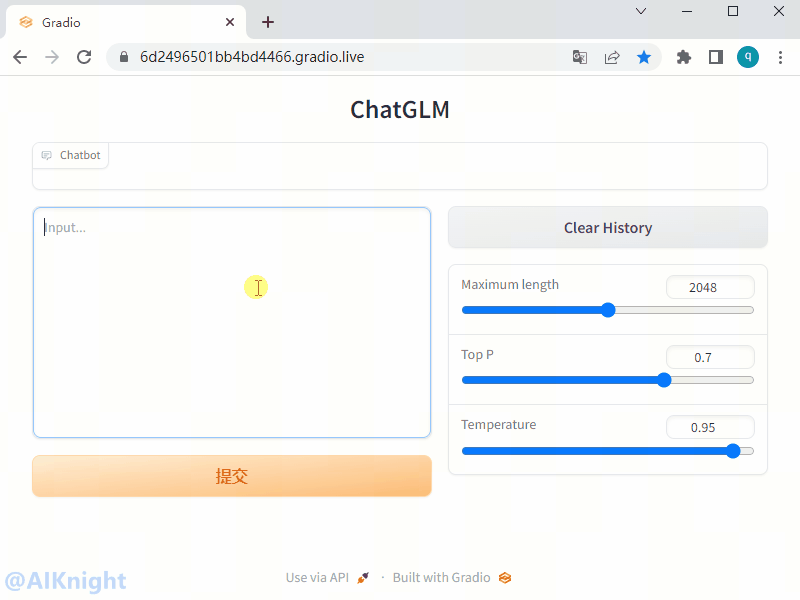

<p align="center">
    <a href="https://gitee.com/cambriconknight/dev-env-ubuntu/tree/master/pytorch1.9/chatglm2">
        
        <h1 align="center">ChatGLM2模型移植教程</h1>
    </a>
</p>

**该教程仅仅用于学习，打通流程； 不对效果负责，不承诺商用。**

[TOC]

# 1. 环境准备

## 1.1. 硬件环境

| 名称           | 数量      | 备注                  |
| :------------ | :--------- | :------------------ |
| 服务器         | 一台       | 采用已完成适配的服务器；PCIe Gen.4 x16 |
| MLU370-X8     | 8卡       | X8需使用板卡自带的8pin连接器连接主板电源 |

## 1.2. 软件环境

| 名称                   | 版本/文件                                                 | 备注                                 |
| :-------------------- | :-------------------------------                         | :---------------------------------- |
| Linux OS              | Ubuntu18.04/Ubuntu20.04/CentOS7                          | 宿主机操作系统                         |
| Docker Image          | pytorch-v1.15.0-torch1.9-ubuntu18.04-py37.tar.gz         | 官方发布的 Pytorch 框架 Docker 镜像文件 |
| Driver_MLU370         | cambricon-mlu-driver-centos7-5.10.13-1.x86_64.rpm	       | 依实际服务器操作系统版本选择             |
| DeepSpeed             | cndsp-0.8.0-py3-none-any.whl                             | Cambricon DeepSpeed                 |
| 工具包                 | https://github.com/CambriconKnight/dev-env-ubuntu        | [Github地址](https://github.com/CambriconKnight/dev-env-ubuntu) |
| ChatGLM2-6B 源码       | https://github.com/THUDM/ChatGLM2-6B  | commit： 3d0225f969d56c058f052f6800a21630d14a1184 |
| Transformers 源码      | https://github.com/huggingface/transformers  | v4.30.2                         |
| ChatGLM2-6B 模型         | https://huggingface.co/THUDM/chatglm2-6b	  | 直接clone 速度慢，并且为保持版本对应，也可关注微信公众号 【 AIKnight 】, 发送关键字 **chatglm2-6b** 自动获取。|

**下载地址:**
- 前往[寒武纪开发者社区](https://developer.cambricon.com)注册账号按需下载， 也可在官方提供的专属FTP账户指定路径下载。
- 文档: https://developer.cambricon.com/index/document/index/classid/3.html
- SDK: https://sdk.cambricon.com/download?component_name=PyTorch

**AIKnight公众号**
>

## 1.3. 下载仓库
```bash
#进入裸机工作目录，以【/data/github】工作目录为例
cd /data/github
#下载仓库
git clone https://github.com/CambriconKnight/dev-env-ubuntu.git
#进入【工具包目录】
cd ./dev-env-ubuntu/pytorch1.9
```
## 1.4. 加载镜像

请提前下载好【Docker镜像】，方便以下操作加载使用。

```bash
#进入【工具包目录】
cd ./dev-env-ubuntu/pytorch1.9
#下载Docker镜像后，可以mv到当前docker目录
#加载Docker镜像
#./load-image-dev.sh ./docker/pytorch-v1.15.0-torch1.9-ubuntu18.04-py37.tar.gz
./load-image-dev.sh ${FULLNAME_IMAGES}
```

## 1.5. 启动容器

镜像加载完成后，运行脚本，进入Docker容器。

```bash
#进入【工具包目录】
cd ./dev-env-ubuntu/pytorch1.9
#启动Docker容器
./run-container-dev.sh
```

# 2. 模型推理
## 2.1. 安装LFS

安装 Git LFS，实现 Git 对大文件的支持.
```bash
# 进到容器后，切换到工作目录
mkdir -p /workspace/chatglm2 && cd /workspace/chatglm2
apt-get update
# 安装 Git LFS，实现 Git 对大文件的支持
apt-get install git-lfs
#yum install git-lfs
# Silence all safe.directory warnings
git config --global --add safe.directory '*'
# 执行如下命令后，如果显示Git LFS initialized说明安装成功
git lfs install
# 升级numpy版本
pip install numpy --upgrade
```
## 2.2. 下载代码

下载 transformers 及 chatglm2-6b 源码及对应版本的 chatglm2-6b 模型（模型较大，下载时间比较长）。
```bash
# 进到容器后，切换到工作目录
cd /workspace/chatglm2
# 1. 下载 transformers 源码: 基于 transformer 模型结构提供的预训练语言库
git clone -b v4.30.2 https://github.com/huggingface/transformers
# 2. 下载 chatglm2-6b 源码
git clone https://github.com/THUDM/ChatGLM2-6B
cd ChatGLM2-6B && git checkout 3d0225f969d56c058f052f6800a21630d14a1184 && cd -
# 3. 下载 chatglm2-6b 模型实现
##第一种方式： 不推荐使用以下命令。直接 git clone 大模型文件的话，下载模型时间较长.
# git clone https://huggingface.co/THUDM/chatglm2-6b
##第二种方式： 采用如下方式， git clone 并手动下载或拷贝过来模型，会更方便些。
GIT_LFS_SKIP_SMUDGE=1 git clone https://huggingface.co/THUDM/chatglm2-6b
# 然后从 https://cloud.tsinghua.edu.cn/d/fb9f16d6dc8f482596c2/ 手动下载的模型和参数文件，替换到本地的 chatglm2-6b 目录下。
#cp -rvf /data/models/chatglm2-6b/pretrained_model/chatglm2-6b/pytorch_model-0000*.bin ./chatglm2-6b
#cp -rvf /data/models/chatglm2-6b/pretrained_model/chatglm2-6b/ice_text.model ./chatglm2-6b
# 注意： 如果后续操作中，有shape mismatch之类报错，多半是模型更新了，需要下载对应的模型。
##第三种方式(推荐)： 为保证与以上代码对应的模型，也可通过关注微信公众号 【AIKnight】,
# 发送关键字(不区分大小写): **chatglm2-6b**, 公众号会自动回复对应下载地址.
# 下载完毕后，可把下载后的【chatglm2-6b】目录拷贝到当前目录。
cp -rvf /data/baidudisk/chatglm2-6b ./
#cp -rvf /data/models/chatglm2-6b/ ./
#mv -f /DATA_SPACE/baidudisk/chatglm2-6b ./
```

## 2.3. 模型适配
### 2.3.1. 自动迁移代码

使用工具 `torch_gpu2mlu.py` 从 GPU 模型脚本迁移至 MLU 设备运行，转换后的模型脚本只支持 MLU 设备运行。该工具可对模型脚本进行转换，对模型脚本修改位置较多，会对修改位置进行统计，实现开发者快速迁移。

- 在容器环境中，执行以下命令
```bash
cd /workspace/chatglm2
#建立软连接
ln -s /torch/src/catch/tools/torch_gpu2mlu.py ./
#执行转换模型脚本, 自动修改 transformers 源码
python torch_gpu2mlu.py -i transformers
#执行转换模型脚本, 自动修改  ChatGLM2-6B 源码
python torch_gpu2mlu.py -i ChatGLM2-6B
#显示转换后的代码。
#ls -lh transformers transformers_mlu ChatGLM2-6B ChatGLM2-6B_mlu
ls -la
```

- 输出转换结果
```bash

```

### 2.3.2. 手动修改代码

由于 chatglm2-6b 要求使用 torch >=1.10，其中有 pytorch 不支持的特性包括如下。需要在【自动迁移代码】基础上再进行如下修改。

进入工作目录，拷贝修改后的代码到【chatglm2-6b】目录。
```bash
# 进入工作目录
cd /workspace/chatglm2
cp -rvf /workspace/chatglm2/tools/modeling_chatglm.py ./chatglm2-6b
```
也可按照以下流程，直接手动修改 modeling_chatglm.py 源码。
```bash
# 进入预训练模型路径（以实际为准）
cd ./chatglm2-6b
vim modeling_chatglm.py
```
*注：不同版本可能有差异，根据实际行数修改*

```bash
diff --git a/modeling_chatglm.py b/modeling_chatglm.py
index 7eda1a4..1ec6a59 100644
--- a/modeling_chatglm.py
+++ b/modeling_chatglm.py
@@ -11,7 +11,10 @@ import torch.utils.checkpoint
 import torch.nn.functional as F
 from torch import nn
 from torch.nn import CrossEntropyLoss, LayerNorm
-from torch.nn.utils import skip_init
+#from torch.nn.utils import skip_init
+def skip_init(cls, *args, **kwargs):
+    return cls(*args, **kwargs)
+
 from typing import Optional, Tuple, Union, List, Callable, Dict, Any

 from transformers.modeling_outputs import (
@@ -27,11 +30,11 @@ from .configuration_chatglm import ChatGLMConfig

 # flags required to enable jit fusion kernels

-if sys.platform != 'darwin':
-    torch._C._jit_set_profiling_mode(False)
-    torch._C._jit_set_profiling_executor(False)
-    torch._C._jit_override_can_fuse_on_cpu(True)
-    torch._C._jit_override_can_fuse_on_gpu(True)
+#if sys.platform != 'darwin':
+#    torch._C._jit_set_profiling_mode(False)
+#    torch._C._jit_set_profiling_executor(False)
+#    torch._C._jit_override_can_fuse_on_cpu(True)
+#    torch._C._jit_override_can_fuse_on_gpu(True)

 logger = logging.get_logger(__name__)

@@ -154,7 +157,7 @@ class RMSNorm(torch.nn.Module):
         input_dtype = hidden_states.dtype
         variance = hidden_states.to(torch.float32).pow(2).mean(-1, keepdim=True)
         hidden_states = hidden_states * torch.rsqrt(variance + self.eps)
-
+        hidden_states = hidden_states.to(input_dtype)
         return (self.weight * hidden_states).to(input_dtype)


@@ -696,7 +699,8 @@ class ChatGLMModel(ChatGLMPreTrainedModel):
         )

         self.rotary_pos_emb = RotaryEmbedding(rotary_dim // 2, original_impl=config.original_rope, device=device,
-                                              dtype=config.torch_dtype)
+                                              dtype=torch.float32)
+                                              #dtype=config.torch_dtype)
         self.encoder = init_method(GLMTransformer, config, **init_kwargs)
         self.output_layer = init_method(nn.Linear, config.hidden_size, config.padded_vocab_size, bias=False,
                                         dtype=config.torch_dtype, **init_kwargs)
@@ -729,7 +733,7 @@ class ChatGLMModel(ChatGLMPreTrainedModel):
             inputs_embeds = self.embedding(input_ids)

         if full_attention_mask is None:
-            if (attention_mask is not None and not attention_mask.all()) or (past_key_values and seq_length != 1):
+            if (attention_mask is not None and not attention_mask.cpu().all()) or (past_key_values and seq_length != 1):
                 full_attention_mask = self.get_masks(input_ids, past_key_values, padding_mask=attention_mask)

         # Rotary positional embeddings
```


### 2.3.3. 安装依赖库

```bash
# 安装 ChatGLM2-6B 依赖库
cd /workspace/chatglm2/ChatGLM2-6B_mlu
sed -i 's/torch/# torch/' requirements.txt
sed -i 's/transformers/# transformer/' requirements.txt
pip install -r requirements.txt
# 安装 transformers
cd ../transformers_mlu/
pip install -e .
```

## 2.4. 测试验证
```bash
# 进入ChatGLM2-6B_mlu路径（以实际为准）
cd /workspace/chatglm2/ChatGLM2-6B_mlu

# 根据使用的demo，修改cli_demo.py或web_demo.py或api.py中的预训练模型路径“THUDM/chatglm2-6b”为实际路径，本教程中此路径修改为【../chatglm2-6b】。
#tokenizer = AutoTokenizer.from_pretrained("THUDM/chatglm2-6b", trust_remote_code=True)
#model = AutoModel.from_pretrained("THUDM/chatglm2-6b", trust_remote_code=True).half().mlu()
tokenizer = AutoTokenizer.from_pretrained("../chatglm2-6b", trust_remote_code=True)
model = AutoModel.from_pretrained("../chatglm2-6b", trust_remote_code=True).mlu()
#也可执行以下命令，直接拷贝修改后的文件
cp -rvf /workspace/chatglm2/tools/cli_demo.py ./
# CLI测试验证
export MLU_VISIBLE_DEVICES=0
python cli_demo.py

# 或python web_demo.py 或python api.py
# 注意：如使用web_demo.py，需修改demo.queue().launch(share=False, inbrowser=True)中share=True，否则无法看到gradio地址
cp -rvf /workspace/chatglm2/tools/web_demo.py ./
# WEB测试验证
python web_demo.py

# API测试验证
cp -rvf /workspace/chatglm2/tools/api.py ./
python api.py
```

### 2.4.1. 测试CLI实例

使用 cli_demo.py测试。

*加载比较慢，大概需要10分钟，可耐心等待。*
```bash
(pytorch) root@worker1:/workspace/chatglm2/ChatGLM2-6B_mlu# python cli_demo.py
Explicitly passing a `revision` is encouraged when loading a model with custom code to ensure no malicious code has been contributed in a newer revision.
Explicitly passing a `revision` is encouraged when loading a configuration with custom code to ensure no malicious code has been contributed in a newer revision.
Explicitly passing a `revision` is encouraged when loading a model with custom code to ensure no malicious code has been contributed in a newer revision.
Loading checkpoint shards: 100%|███████████████████████████████████████████████████████████████████████████████████████████████████████| 8/8 [00:11<00:00,  1.41s/it]
欢迎使用 ChatGLM2-6B 模型，输入内容即可进行对话，clear 清空对话历史，stop 终止程序

用户：chatGPT是啥?

ChatGLM2-6B：ChatGPT是美国人工智能研究实验室OpenAI于2022年11月推出的一个人工智能聊天机器人程序，该程序基于大型语言模型GPT-3.5，使用指令微调(Instruction Tuning)和基于人类反馈的强化学习技术(RLHF)训练而成。

用户：stop
(pytorch) root@worker1:/workspace/chatglm2/ChatGLM2-6B_mlu#
```

### 2.4.2. 测试WEB实例

使用 web_demo.py测试 ，需修改 demo.queue().launch(share=False, inbrowser=True) 中 share=True ，否则无法看到 gradio 地址。

*加载比较慢，大概需要10分钟，可耐心等待。*

```bash
(pytorch) root@worker1:/workspace/chatglm2/ChatGLM2-6B_mlu# python web_demo.py
Explicitly passing a `revision` is encouraged when loading a model with custom code to ensure no malicious code has been contributed in a newer revision.
Explicitly passing a `revision` is encouraged when loading a configuration with custom code to ensure no malicious code has been contributed in a newer revision.
Explicitly passing a `revision` is encouraged when loading a model with custom code to ensure no malicious code has been contributed in a newer revision.
Loading checkpoint shards: 100%|███████████████████████████████████████████████████████████████████████████████████████████████████████| 8/8 [00:10<00:00,  1.29s/it]
Running on local URL:  http://127.0.0.1:7860
Running on public URL: https://6d2496501bb4bd4466.gradio.live

This share link expires in 72 hours. For free permanent hosting and GPU upgrades (NEW!), check out Spaces: https://huggingface.co/spaces
```

**Web展示效果**
<p align="left">
    
</p>


*待补充*
