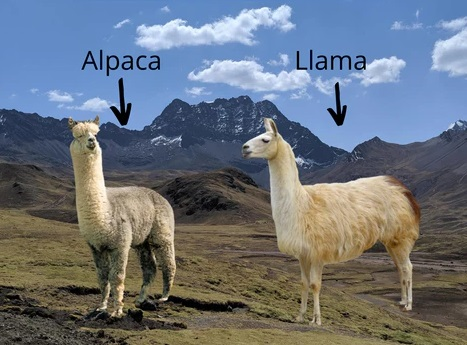

<p align="center">
    <a href="https://gitee.com/cambriconknight/dev-env-ubuntu/tree/master/pytorch1.9/chinese-llama-alpaca-2">
        
        <h1 align="center">Chinese-LLaMA-Alpaca-2模型验证教程</h1>
    </a>
</p>

**该教程仅仅用于学习，打通流程； 不对效果负责，不承诺商用。**

[TOC]

# 1. 环境准备

## 1.1. 硬件环境

| 名称           | 数量      | 备注                  |
| :------------ | :--------- | :------------------ |
| 服务器         | 一台       | 采用已完成适配的服务器；PCIe Gen.4 x16 |
| MLU370-X8     | 8卡       | X8需使用板卡自带的8pin连接器连接主板电源 |

## 1.2. 软件环境

| 名称                   | 版本/文件                                                 | 备注                                 |
| :-------------------- | :-------------------------------                         | :---------------------------------- |
| Linux OS              | Ubuntu18.04/Ubuntu20.04/CentOS7                          | 宿主机操作系统                         |
| Docker Image          | pytorch-v1.15.0-torch1.9-ubuntu18.04-py37.tar.gz         | 官方发布的 Pytorch 框架 Docker 镜像文件 |
| Driver_MLU370         | cambricon-mlu-driver-centos7-5.10.13-1.x86_64.rpm	       | 依实际服务器操作系统版本选择             |
| DeepSpeed             | cndsp-0.8.0-py3-none-any.whl                             | Cambricon DeepSpeed                 |
| 工具包                 | https://github.com/CambriconKnight/dev-env-ubuntu        | [Github地址](https://github.com/CambriconKnight/dev-env-ubuntu) |
| Chinese-LLaMA-Alpaca-2 官网源码 | https://github.com/ymcui/Chinese-LLaMA-Alpaca-2          | commit：84b4c3ef3689c3ef76016895ccaa1b28c56ef6a4 |
| Chinese-LLaMA-Alpaca-2 适配链接 | https://gitee.com/xiaoqi25478/Chinese-LLaMA-Alpaca-2_mlu  | MLU 源码                         |
| Transformers 适配链接  | https://gitee.com/xiaoqi25478/open-codes-mlu.git           | 原始链接版本：v4.30.0                          |
| Peft 适配链接          | https://gitee.com/xiaoqi25478/open-codes-mlu.git                    | 原始链接版本：v0.3.0                          |
| Accelerate 适配链接    | https://gitee.com/xiaoqi25478/open-codes-mlu.git              | 原始链接版本：v0.20.3                          |
| 中文LLaMA-2基座7B模型   | https://huggingface.co/ziqingyang/chinese-llama-2-7b  | 可关注微信公众号 【 AIKnight 】, 发送关键字 **中文LLaMA-2基座7B模型** 自动获取。|
| 中文Alpaca-2聊天7B模型 | https://huggingface.co/ziqingyang/chinese-alpaca-2-7b  | 可关注微信公众号 【 AIKnight 】, 发送关键字 **中文Alpaca-2聊天7B模型** 自动获取。|
| 中文LLaMA-2基座13B模型 | https://huggingface.co/ziqingyang/chinese-llama-2-13b  | 可关注微信公众号 【 AIKnight 】, 发送关键字 **中文LLaMA-2基座13B模型** 自动获取。|
| 中文Alpaca-2聊天13B模型 | https://huggingface.co/ziqingyang/chinese-alpaca-2-13b  | 可关注微信公众号 【 AIKnight 】, 发送关键字 **中文Alpaca-2聊天13B模型** 自动获取。|

*注：以下步骤以Alpaca-2聊天13B模型为例，其他模型操作类似。*

**下载地址:**
- 前往[寒武纪开发者社区](https://developer.cambricon.com)注册账号按需下载， 也可在官方提供的专属FTP账户指定路径下载。
- 文档: https://developer.cambricon.com/index/document/index/classid/3.html
- SDK: https://sdk.cambricon.com/download?component_name=PyTorch
- 完整模型下载: https://github.com/ymcui/Chinese-LLaMA-Alpaca-2#完整模型下载

**AIKnight公众号**
>

## 1.3. 下载仓库
```bash
#进入裸机工作目录，以【/data/github】工作目录为例
cd /data/github
#下载仓库
git clone https://github.com/CambriconKnight/dev-env-ubuntu.git
#进入【工具包目录】
cd ./dev-env-ubuntu/pytorch1.9
```
## 1.4. 加载镜像

请提前下载好【Docker镜像】，方便以下操作加载使用。

```bash
#进入【工具包目录】
cd ./dev-env-ubuntu/pytorch1.9
#下载Docker镜像后，可以mv到当前docker目录
#加载Docker镜像
#./load-image-dev.sh ./docker/pytorch-v1.15.0-torch1.9-ubuntu18.04-py37.tar.gz
sudo ./load-image-dev.sh ${FULLNAME_IMAGES}
```

## 1.5. 启动容器

镜像加载完成后，运行脚本，进入Docker容器。

```bash
#进入【工具包目录】
cd ./dev-env-ubuntu/pytorch1.9
#启动Docker容器
sudo ./run-container-dev.sh
```

# 2. 代码适配

详见相关 [文档中心](https://developer.cambricon.com/index/document/index/classid/3.html) 适配手册：
[寒武纪 PyTorch v1.9网络移植手册](https://www.cambricon.com/docs/sdk_1.13.0/cambricon_pytorch_1.15.0/porting_1.9/index.html)
[寒武纪 PyTorch v1.6⽹络移植⼿册](https://www.cambricon.com/docs/sdk_1.13.0/cambricon_pytorch_1.15.0/porting_1.6/index.html)

# 3. 模型验证
## 3.1. 下载适配代码

```bash
# 创建工作目录
mkdir -p /workspace/chinese-llama-alpaca-2
# 进到容器后，切换到工作目录
#cd /home/share/pytorch1.9/chinese-llama-alpaca-2
cd /workspace/chinese-llama-alpaca-2
# 1. 下载 chinese-llama-alpaca-2-13B 源码
git clone https://gitee.com/xiaoqi25478/Chinese-LLaMA-Alpaca-2_mlu.git
# 2. 下载适配后的依赖库源码 accelerate_mlu、transformers_mlu、peft_mlu
git clone https://gitee.com/xiaoqi25478/open-codes-mlu.git
```

## 3.2. 安装依赖库

**安装第三方依赖库**
```bash
# 进到容器后，切换到工作目录
cd /home/share/pytorch1.9/chatglm
apt-get update
# 安装 Git LFS，实现 Git 对大文件的支持
apt-get install git-lfs
#yum install git-lfs
# Silence all safe.directory warnings
git config --global --add safe.directory '*'
# 执行如下命令后，如果显示Git LFS initialized说明安装成功
git lfs install
# 升级numpy版本
pip install numpy --upgrade
# 安装 gradio
#pip install gradio
```

**安装MLU适配后的代码依赖库**
```bash
# 进到容器后，切换到工作目录
cd /workspace/chinese-llama-alpaca-2
# 安装 accelerate 依赖库
cd /workspace/chinese-llama-alpaca-2/open-codes-mlu/accelerate_0.20.3_mlu
pip install -e .
# 安装 transformers 依赖库
cd /workspace/chinese-llama-alpaca-2/open-codes-mlu/transformers_4.30.0_mlu
pip install -e .
# 安装 peft 依赖库
cd /workspace/chinese-llama-alpaca-2/open-codes-mlu/peft_0.3.0.dev0_mlu
pip install -e .
# 安装 cndsp(Cambricon DeepSpeed）
cd /workspace/chinese-llama-alpaca-2/open-codes-mlu
wget https://sdk.cambricon.com/static/Basis/MLU370_X86_ubuntu18.04/cndsp-0.8.0-py3-none-any.whl
pip install cndsp-0.8.0-py3-none-any.whl
# 安装 Chinese-LLaMA-Alpaca-2 依赖库
#cd /home/share/pytorch1.9/chinese-llama-alpaca-2/Chinese-LLaMA-Alpaca-2_mlu
cd /workspace/chinese-llama-alpaca-2/Chinese-LLaMA-Alpaca-2_mlu
pip install -r requirements.txt
```

## 3.3. 模型下载
*注：以下步骤以Alpaca-2聊天13B模型为例，其他模型操作类似。*
```bash
mkdir -p /workspace/chinese-llama-alpaca-2/models
cd /workspace/chinese-llama-alpaca-2/models
# 下载模型
##第一种方式： 不推荐使用以下命令。直接 git clone 大模型文件的话，下载模型时间较长.
# git clone https://huggingface.co/ziqingyang/chinese-alpaca-2-13b
##第二种方式： 采用如下方式， git clone 并手动下载或拷贝过来模型，会更方便些。
GIT_LFS_SKIP_SMUDGE=1 git clone https://huggingface.co/ziqingyang/chinese-alpaca-2-13b
# 然后参考如下表格中下载链接手动下载的模型和参数文件，替换到本地的 chinese-alpaca-2-13b 目录下。
```
以下是完整版Chinese-Alpaca-2-13B模型，直接下载即可使用，无需其他合并步骤。推荐网络带宽充足的用户。

| 模型名称                  |   类型   | 大小 |                    下载地址                    |
| :------------------------ | :------: | :----------------------------------------------------------: | :----------------------------------------------------------: |
| Chinese-Alpaca-2-13B | 指令模型 | 24.7 GB | [[百度]](https://pan.baidu.com/s/1MT_Zlap1OtdYMgoBNTS3dg?pwd=9xja) [[Google]](https://drive.google.com/drive/folders/1MTsKlzR61xmbTR4hBWzQas_MOpUZsogN?usp=share_link) [[🤗HF]](https://huggingface.co/ziqingyang/chinese-alpaca-2-13b) |

## 3.4. 模型推理
```bash
# 进入 Chinese-LLaMA-Alpaca-2_mlu 路径（以实际为准）
#cd /home/share/pytorch1.9/chinese-llama-alpaca-2/Chinese-LLaMA-Alpaca-2_mlu
cd /workspace/chinese-llama-alpaca-2/Chinese-LLaMA-Alpaca-2_mlu
# 激活环境变量，请注意下载模型，并根据实际环境，修改模型路径。
source env.sh
# gradio 推理对话
cd cambricon
# model_path=/workspace/chinese-llama-alpaca-2/models/chinese-alpaca-2-13b
bash mlu_infer.sh
```

*待补充*
