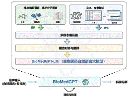
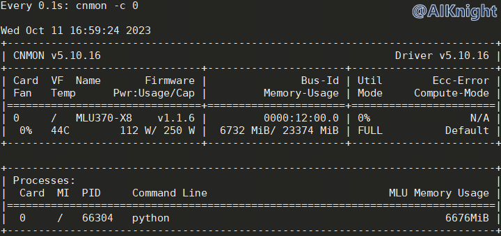

<p align="center">
    <a href="https://gitee.com/cambriconknight/dev-env-ubuntu/tree/master/pytorch1.9/openbiomed">
        
        <h1 align="center">OpenBioMed模型验证教程</h1>
    </a>
</p>

**该教程仅仅用于学习，打通流程； 不对效果负责，不承诺商用。**

[TOC]

# 1. 环境准备

OpenBioMed 是一个生物医学的 Python 深度学习工具包。

OpenBioMed 提供了多模态生物医学数据的处理接口，包括小分子、蛋白质和单细胞的分子结构、转录组学、知识图谱和生物医学文本数据。

OpenBioMed 支持广泛的下游应用，包括 AI 药物发现任务和更具挑战性的多模态理解生成任务。

## 1.1. 硬件环境

| 名称           | 数量      | 备注                  |
| :------------ | :--------- | :------------------ |
| 服务器         | 一台       | 采用已完成适配的服务器；PCIe Gen.4 x16 |
| MLU370-X8     | 8卡       | X8需使用板卡自带的8pin连接器连接主板电源 |

## 1.2. 软件环境

| 名称                   | 版本/文件                                                 | 备注                                 |
| :-------------------- | :-------------------------------                         | :---------------------------------- |
| Linux OS              | Ubuntu18.04/Ubuntu20.04/CentOS7                          | 宿主机操作系统                         |
| Docker Image          | pytorch-v1.15.0-torch1.9-ubuntu18.04-py37.tar.gz         | 官方发布的 Pytorch 框架 Docker 镜像文件 |
| Driver_MLU370         | cambricon-mlu-driver-centos7-5.10.13-1.x86_64.rpm	       | 依实际服务器操作系统版本选择             |
| 工具包                 | https://github.com/CambriconKnight/dev-env-ubuntu        | [Github地址](https://github.com/CambriconKnight/dev-env-ubuntu) |
| OpenBioMed 源码        | https://github.com/PharMolix/OpenBioMed  | commit： 2ab7cb4 |
| OpenBioMed MLU适配源码 | https://github.com/huismiling/OpenBioMed.git  | branch： mlu-dev |
| Transformers 源码      | https://github.com/huggingface/transformers  | v4.30.2                         |
| BioMedGPT-LM-7B 模型   | https://huggingface.co/PharMolix/BioMedGPT-LM-7B	  | 也可关注微信公众号 【 AIKnight 】, 发送关键字 **BioMedGPT-LM-7B** 自动获取。|
| ESM2-3B 模型   | https://huggingface.co/facebook/esm2_t36_3B_UR50D	  | 也可关注微信公众号 【 AIKnight 】, 发送关键字 **ESM2-3B** 自动获取。|
| BioMedGPT-10B 模型   | https://pan.baidu.com/s/1iAMBkuoZnNAylhopP5OgEg?pwd=7a6b#list/path=%2F	  | 也可关注微信公众号 【 AIKnight 】, 发送关键字 **BioMedGPT-10B** 自动获取。|

**下载地址:**
- 前往[寒武纪开发者社区](https://developer.cambricon.com)注册账号按需下载， 也可在官方提供的专属FTP账户指定路径下载。
- 文档: https://developer.cambricon.com/index/document/index/classid/3.html
- SDK: https://sdk.cambricon.com/download?component_name=PyTorch

**AIKnight公众号**
>

## 1.3. 下载仓库
```bash
#进入裸机工作目录，以【/data/github】工作目录为例
cd /data/github
#下载仓库
git clone https://github.com/CambriconKnight/dev-env-ubuntu.git
#进入【工具包目录】
cd ./dev-env-ubuntu/pytorch1.9
```
## 1.4. 加载镜像

请提前下载好【Docker镜像】，方便以下操作加载使用。

```bash
#进入【工具包目录】
cd ./dev-env-ubuntu/pytorch1.9
#下载Docker镜像后，可以mv到当前docker目录
#加载Docker镜像
#./load-image-dev.sh ./docker/pytorch-v1.15.0-torch1.9-ubuntu18.04-py37.tar.gz
./load-image-dev.sh ${FULLNAME_IMAGES}
```

## 1.5. 启动容器

镜像加载完成后，运行脚本，进入Docker容器。

```bash
#进入【工具包目录】
cd ./dev-env-ubuntu/pytorch1.9
#启动Docker容器
./run-container-dev.sh
```

# 2. 模型推理
## 2.1. 下载代码
下载源码及对应版本的模型（模型较大，下载时间比较长），并修改部分环境。
```bash
# 进到容器后，切换到工作目录
mkdir -p /workspace/openbiomed
cd /workspace/openbiomed
# 1. 下载 OpenBioMed 源码
git clone -b mlu-dev https://github.com/huismiling/OpenBioMed.git
# 2. 下载 pytorch_geometric 源码
git clone -b mlu-dev https://github.com/huismiling/pytorch_geometric.git
# 3. 安装OpenBioMed
cd /workspace/openbiomed/OpenBioMed
pip install -r requirements.txt
# 4. 安装torch-1.9.0+cpu及其他
pip install torch_scatter torch_cluster torch_spline_conv -f https://data.pyg.org/whl/torch-1.9.0+cpu.html
pip install git+https://github.com/huismiling/pytorch_geometric.git@mlu-dev
# 5. 下载模型
#手动下载模型，参考如下步骤放置到指定目录。
# 参考OpenBioMed/examples/biomedgpt_inference.ipynb。
# 将模型BioMedGPT-LM-7B改名后放在OpenBioMed/ckpts/text_ckpts/biomedgpt-lm-7b下
cp -rvf /data/models/openbiomed/BioMedGPT-LM-7B ./ckpts/text_ckpts/biomedgpt-lm-7b
# 模型ESM2-3B改名后放在OpenBioMed/ckpts/protein_ckpts/esm2-3b下
mkdir -p ./ckpts/protein_ckpts
cp -rvf /data/models/openbiomed/esm2_t36_3B_UR50D ./ckpts/protein_ckpts/esm2-3b
# 将biomedgpt_10b.pth放在OpenBioMed/ckpts/fusion_ckpts/biomedgpt_10b.pth下
cp -rvf /data/models/openbiomed/OpenBioMed/BioMedGPT/checkpoint/BioMedGPT/biomedgpt_10b.pth ./ckpts/fusion_ckpts/biomedgpt_10b.pth

# 6. 根据实际验证过程，还需进行如下修改。
# 卸载 torch_cluster
pip uninstall torch_cluster
# 安装protobuf==3.20.3
pip install protobuf==3.20.3
# 修改/torch/venv3/pytorch/lib/python3.7/site-packages/torch_geometric/utils/sparse.py 文件中，is_torch_sparse_tensor函数，函数直接返回False。
cp -rvf ../../pytorch_geometric/torch_geometric/utils/sparse.py /torch/venv3/pytorch/lib/python3.7/site-packages/torch_geometric/utils/sparse.py
```

## 2.2. 测试验证
```bash
# 根据需要设置被测试板卡
export MLU_VISIBLE_DEVICES=0
# 推理测试: 在OpenBioMed/examples目录下，运行 python biomedgpt_inference.py 即可进行推理测试。
cd /workspace/openbiomed/OpenBioMed/examples
python biomedgpt_inference.py
```

**测试实例**

*加载比较慢，大概需要10分钟，可耐心等待。*

```bash
(pytorch) root@worker1:/workspace/openbiomed/OpenBioMed/examples# python biomedgpt_inference.py
Config:  {'name': 'biomedgptv', 'data': {'mol': {'modality': ['structure'], 'featurizer': {'structure': {'name': 'BaseGNN'}}}, 'protein': {'modality': ['structure'], 'featurizer': {'structure': {'name': 'transformertok', 'transformer_type': 'esm', 'model_name_or_path': '/workspace/openbiomed/OpenBioMed/ckpts/protein_ckpts/esm2-3b', 'max_length': 1024}}}}, 'network': {'mol': {'gin_hidden_dim': 300, 'gin_num_layers': 5, 'drop_ratio': 0.0, 'max_n_nodes': 256, 'freeze': True}, 'protein': {'model_name_or_path': '/workspace/openbiomed/OpenBioMed/ckpts/protein_ckpts/esm2-3b', 'lora': False, 'freeze': True, 'use_float16': True}, 'llm': {'model_name_or_path': '/workspace/openbiomed/OpenBioMed/ckpts/text_ckpts/biomedgpt-lm-7b', 'use_float16': True}}}
/torch/venv3/pytorch/lib/python3.7/site-packages/torch/nn/modules/module.py:850: UserWarning:  MLU operators dont support 64-bit calculation. so the 64 bit data will be forcibly converted to 32-bit for calculation.  (Triggered internally at  /torch/catch/torch_mlu/csrc/aten/util/tensor_util.cpp:153.)
  return t.to(device, dtype if t.is_floating_point() or t.is_complex() else None, non_blocking)
Finish loading model
[2023-10-11 15:20:33] [CNNL] [Warning]:[cnnlClip] is deprecated and will be removed in the future release, please use [cnnlClip_v2] instead.
Human:  Please describe this molecule.
/torch/venv3/pytorch/lib/python3.7/site-packages/transformers/generation/configuration_utils.py:369: UserWarning: `do_sample` is set to `False`. However, `top_p` is set to `0.9` -- this flag is only used in sample-based generation modes. You should set `do_sample=True` or unset `top_p`.
  UserWarning,
Assistant:  The molecule is a member of the class of flavonoids that is 3-hydroxyflavone substituted by a 3-hydroxy-4-methoxyphenyl group at position 7. It has a role as a plant metabolite. It is a member of flavonoids, a member of 3-hydroxyflavones and a member of 3-hydroxyflavones. It derives from a 3-hydroxyflavone.
Human:  What is the function of this protein?
Assistant:  One of the essential components for the initiation of protein synthesis.  Stabilizes the binding of IF-2 and IF-3 on the 30S subunit to which N-formylmethionyl-tRNA(fMet) subsequently binds.  Helps modulate mRNA selection, yielding the 30S pre-initiation complex (PIC).  Upon addition of the 50S ribosomal subunit IF-1, IF-2 and IF-3 are released leaving the mature 70S translation initiation complex.
(pytorch) root@worker1:/workspace/openbiomed/OpenBioMed/examples#
```

**推理期间MLU资源占用情况**
<p align="left">
    
</p>
